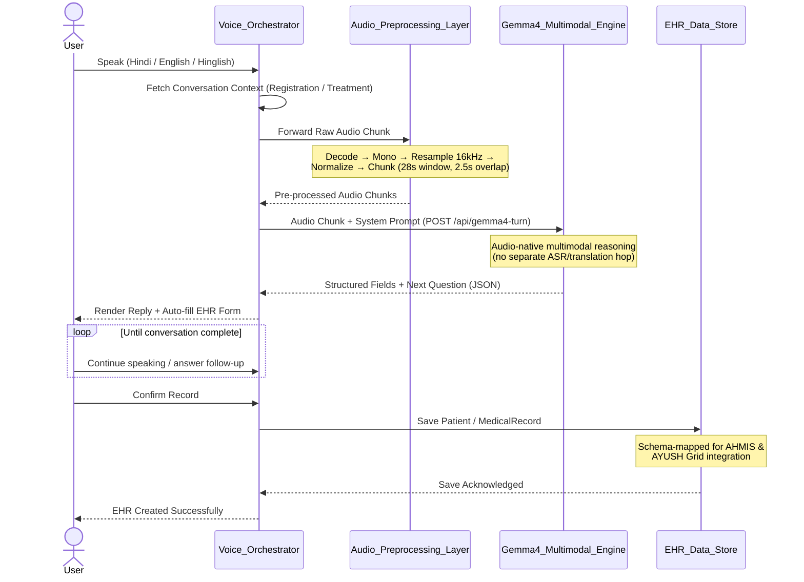
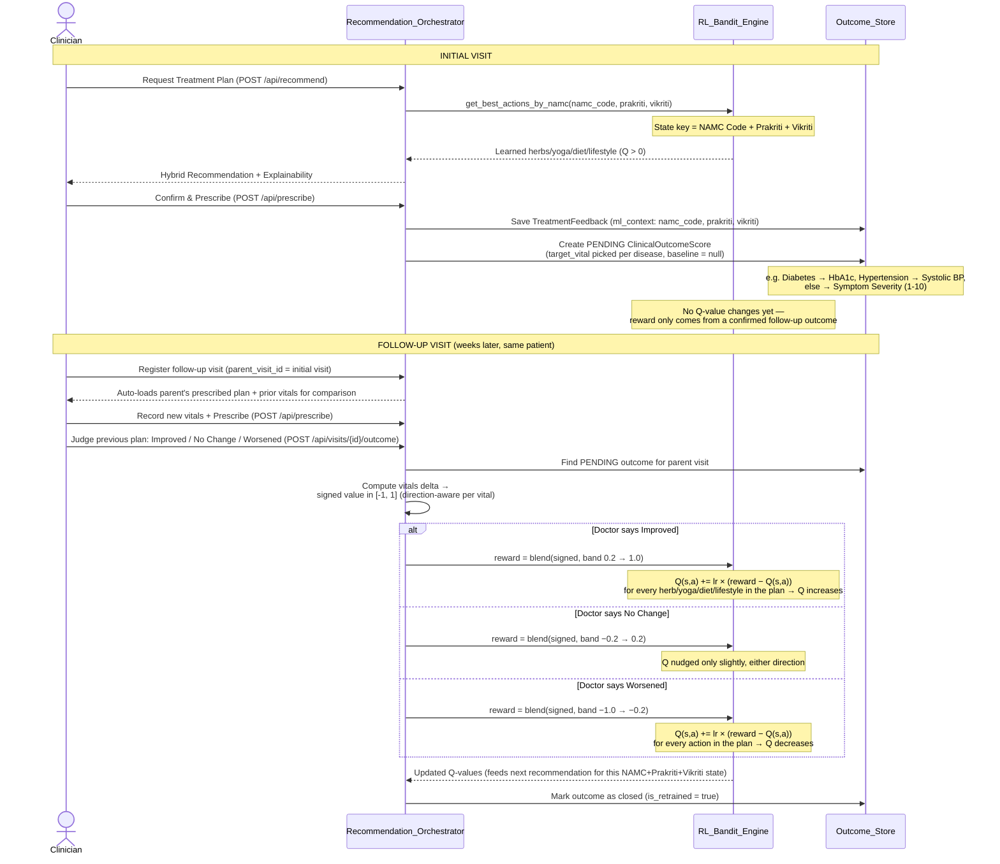
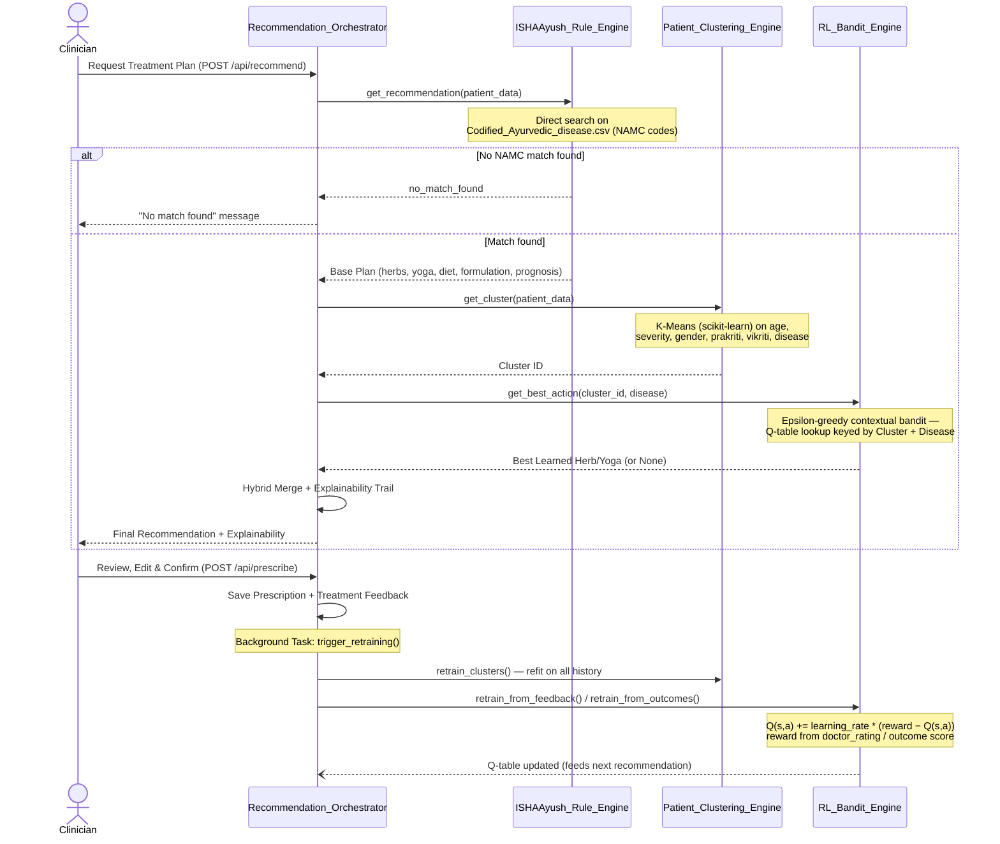
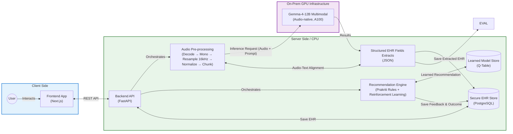

# Hackathon PPT — Working Context

> Purpose: running record of PPT decisions so a new chat can pick up without re-deriving context.
> Update this file every time a slide is finalized or a decision is made.

## Program facts
- IndiaAI Mission hackathon, Problem Statement 3 (Ministry of AYUSH use case).
- Prize pool: ₹25,00,000.
- Full brief: [guidelines.txt](guidelines.txt) (do not edit — source of truth for official wording).
- Deck **structure/flow** is modeled on the team's previous winning deck: [Solution for IDP Challenge.txt](Solution%20for%20IDP%20Challenge.txt) (S4AI, IndiaAI IDP Challenge winner). We reuse its slide *shape*, not its content — that deck was about OCR/document processing, this project is voice/EHR/outbreak/treatment.
- Required content flow per the task brief (build in this order, one stage at a time):
  1. Overview of proposed solution + alignment with Ministry of AYUSH use case
  2. Solution architecture (AI/ML models, tech, system workflow)
  3. Datasets, methodology, key features
  4. Live demonstration

## Ground truth: what's actually built (checked against code, not assumed)
Source: [README.md](README.md), `backend/services/*`, plus a full Explore-agent code audit on 2026-07-04 (verified against actual file contents, not filenames/README alone — README is partly stale). Re-verify if this file gets stale.
- Stack: FastAPI (`backend/main.py`) + Next.js 16/React 19, PostgreSQL (SQLAlchemy models: Patient, MedicalRecord, AyushTreatment, TreatmentFeedback, ClinicalOutcomeScore), CopilotKit + LlamaIndex (AG-UI protocol) agents.
- **Voice pipeline — two paths, one primary:**
  - Primary (default in UI): **Google Gemma-4-12B** multimodal, audio-native — takes raw audio directly in the chat template, no separate ASR/translation hop. Runs on Modal A100. (`modal_gemma4_12b.py`, `GemmaVoiceChatPanel.tsx` defaults to `"gemma4"`.)
  - Fallback path (user-toggleable to "phi4" in UI): AI4Bharat `indic-conformer-600m-multilingual` ASR → AI4Bharat `indictrans2-indic-en-1B` translation → Microsoft **Phi-4-14B** via vLLM on 2× L40S for reasoning/field-extraction.
  - Audio pre-processing (both paths): resampling to 16kHz, normalization, **fixed-time-window chunking** (~20-28s windows, small overlap). **No actual denoising or voice-activity-detection library exists in the repo** (checked: zero hits for webrtcvad/noisereduce/silero-vad) — don't claim VAD/denoising on slides.
  - LLM reasoning is used for conversational field-extraction & summarization only — **not** for generating the final treatment plan text (see below).
- **Personalised Treatment Engine** (`services/hybrid_service.py`, `services/rl_service.py`, `services/patient_clustering_service.py`) — real, not aspirational:
  - Prakriti-based codified rule lookup (ISHAAyush) + **K-Means clustering** (scikit-learn, 10 clusters) on patient demographic/clinical features + **epsilon-greedy contextual bandit** (a real RL method — not deep Q-learning, no state transitions) that upweights herbs/yoga based on clinician feedback (`TreatmentFeedback`, `ClinicalOutcomeScore` tables). `/api/recommend` calls this engine directly — no LLM in the loop for the final plan.
- **Outbreak Forecasting Engine** (`services/gnn_service.py`, `spatial_service.py`, `analytics_service.py`, `disease_forecaster.py`) — real but **not** a trained GNN yet:
  - Anomaly detection = statistical **z-score** on regional case trends.
  - Geospatial clustering = hand-rolled **DBSCAN** (haversine distance), not sklearn.
  - Regional spread = deterministic **graph diffusion over a NetworkX graph** — the code's own comment says explicitly "no trained graph neural network here... Phase 2 will upgrade to a real PyTorch Geometric ST-GNN." **Do not claim a trained/learned GNN is delivered** — describe as graph-based propagation modeling, with a trained ST-GNN as roadmap/Way-Forward item.
  - Per-disease case forecasting = **Random Forest ensemble regression** (`disease_forecaster.py`) — not previously on any slide; directly matches the guideline's "ensemble learning" ask, worth featuring.
  - ARIMA (mentioned in README) is not actually used anywhere in code — don't cite it.
- Focus chronic conditions present in data/prompts: nephrolithiasis, urolithiasis, obesity, hypertension (matches guideline's explicit list).
- No OCR/document-extraction code exists anywhere in this repo — any deck content referencing OCR/table extraction is leftover copy-paste from the old IDP deck and must be removed.
- No live AHMIS / AYUSH Grid integration exists (no access to those systems as a hackathon team) — deck language should say "designed for" / "mapped for" integration, not claim actual integration.
- Deployment: demo runs on Modal.run cloud GPUs for convenience/speed. **Decision (2026-07-04): the "on-prem / air-gapped" claim refers to production deployment on government-provided infra post-selection, not the hackathon demo environment. No contradiction — keep the claim on slides as a deployment capability, not a demo description.**

## Slide-by-slide status

### Slide 1 — Problem Statement — ✅ FINALIZED (2026-07-04)
```
Objective: To develop a secure, scalable, and intelligent AI-powered engine
leveraging Speech-to-Text, NLP, and Hybrid Recommendation systems to automate
EHR creation, forecast regional disease outbreaks, and deliver personalised,
evidence-based AYUSH care.

• Multilingual Voice-Based EHR Creation
• Early Outbreak Detection & Forecasting
• Personalised Treatment & Lifestyle Recommendations

Stage 2 Requirements:
• Enable AYUSH professionals to create structured EHRs on AHMIS using
  voice-based inputs in regional Indian languages, seamlessly translated
  & mapped.
    Target Languages: Multilingual (Major Indian Languages)

• Generate personalised, data-driven treatment plans (herbal, diet, yoga)
  using Prakriti-based logic combined with reinforcement learning on
  clinician feedback & patient outcomes.
    Focus Conditions: Nephrolithiasis, Urolithiasis, Obesity, Hypertension

• Predict short-term regional spread of localised disease surges using
  anomaly detection, geospatial clustering & spatiotemporal graph neural
  networks.
    Core Deliverable: Real-time localised outbreak forecasting & public
    health risk alerts
```
Change from original draft: split the run-on 3-capability line into clean bullets; added a "Focus Conditions" quantifier under the treatment bullet (mirrors IDP deck's "Total Document types: 18" pattern, lifted from guideline's own condition list) so reviewers can checklist-match against the brief.

### Slide 2 — Core Solution — ✅ FINALIZED, then ⚠️ CORRECTED (2026-07-04)
```
Core Solution
Integrated, Scalable AI System for Voice-Based EHR Creation, Outbreak
Early-Warning & Personalised AYUSH Care

• Languages — Hindi, English, Hinglish; extendable to other Indic languages
  by swapping the open-source LLM (no code change)
• Voice-to-EHR Pipeline: Pre-processing (resampling, normalization,
  chunking) → audio-native multilingual LLM understanding (primary path)
  with classical ASR + Indic-English translation as a fallback path →
  structured field extraction into EHR
• Generative Reasoning: LLM-driven structured field extraction &
  consultation summarization from natural voice conversation
• Personalised Treatment Engine: Hybrid recommender — Prakriti-based
  Ayurvedic logic + patient-outcome clustering, continuously refined via
  reinforcement learning on clinician feedback
• Outbreak Forecasting Engine: Anomaly detection + geospatial clustering +
  graph-based spatiotemporal spread propagation, plus per-disease ensemble
  (Random Forest) case forecasting
• Automated accuracy-evaluation pipeline benchmarked on test datasets
• Built on open-source models — deployable fully on-prem / air-gapped for
  complete data sovereignty
```
Change from original draft: **removed** "OCR for handwritten as well as typed documents" and "Extraction of tables, notes, key features" — leftover from the old IDP deck, not applicable to this project. **Added** the Treatment Engine and Outbreak Forecasting Engine bullets, which were completely missing from the original draft despite being 2 of the 3 core pillars. Softened "AHMIS & AYUSH Grid integration" to "mapped for ... integration" since there's no live access to those systems.

**Correction pass (2026-07-04, after code audit):** two bullets overclaimed vs. actual code and were rewritten (see Ground Truth section above for specifics):
1. "Audio denoising, voice-activity detection" → no such code exists; corrected to "Pre-processing (resampling, normalization, chunking)" + honestly describes the dual voice-path (Gemma-4 primary, AI4Bharat/Phi-4 fallback).
2. "Spatiotemporal graph neural network" (as a *delivered* claim) → the code is an untrained graph-diffusion model, not a trained GNN; corrected to "graph-based spatiotemporal spread propagation" and added the real Random Forest ensemble forecaster in its place. (The GNN phrase is still fine on Slide 1 since it quotes the guideline's *ask*, not our delivery.)
3. Also dropped the unconfirmed "prescription/report generation" claim — LLM does field-extraction/summarization only; the treatment plan itself comes from the rule+ML engine, not the LLM.

### Slide 3 — Solution Architecture: AI/ML Models & Methodology — ✅ FINALIZED (2026-07-04)
```
| Category                                     | Model / Methodology                                                                                              |
|-----------------------------------------------|-------------------------------------------------------------------------------------------------------------------|
| Audio Pre-processing                          | Resampling (16kHz), normalization & fixed-window chunking — CPU                                                   |
| Multilingual Voice Understanding               | Google Gemma-4-12B (multimodal, audio-native) — A100 GPU; AI4Bharat IndicConformer ASR + IndicTrans2 as fallback  |
| Conversational Reasoning / Field Extraction    | Microsoft Phi-4-14B via vLLM — 2× L40S GPU                                                                        |
| Patient Clustering                             | K-Means (scikit-learn) on clinical + demographic features                                                         |
| Personalised Treatment Recommendation          | Prakriti-based rule engine + epsilon-greedy contextual bandit (RL), refined via clinician feedback                |
| Outbreak Detection                             | Z-score anomaly detection + DBSCAN geospatial clustering (haversine distance)                                     |
| Regional Spread Forecasting                    | Graph-based spatiotemporal propagation (NetworkX) + Random Forest ensemble regression per disease                 |
| System & Deployment                            | FastAPI + Next.js/React, PostgreSQL; Modal.run GPUs (demo) → on-prem/air-gapped (production)                      |
```
Mirrors the IDP deck's "Category / Model / Methodology" table shape. Every row verified against actual code (not README) via a full Explore-agent audit — see Ground Truth section. Deliberately states Gemma-4-12B as the *primary* voice path with AI4Bharat/Phi-4 as *fallback*, not two parallel features (that's what the code actually does — a UI toggle, default = gemma4).

### Slide 4 — Pipeline Data Flow (2 diagrams) — ✅ FINALIZED, sequence-diagram style (2026-07-04)
User will render these Mermaid diagrams into images themselves. **Format note (2026-07-04):** user provided a reference image (S4AI IDP deck's "Pipeline Data Flow" slide) and asked to match its exact style — Mermaid `sequenceDiagram` with participant lanes, `alt` branch blocks, `Note over` yellow highlight boxes, and self-referencing arrows, rather than `flowchart` boxes-and-arrows. Mermaid's default theme auto-cycles a pastel color per participant lane, which should approximate the reference's multi-color lane look without extra theming.

**Scope decision (2026-07-04):** deck keeps only the Gemma-4 voice/registration diagram (Path A) and the Recommendation Engine diagram (Path B). The AI4Bharat ASR + IndicTrans2 + Phi-4 fallback-path diagram was dropped from the slide — Gemma-4 is the default/primary pipeline being demoed, so the fallback path doesn't need its own deck slide. It's still documented in the Ground Truth section above and in git history if needed later.

**Path A — Gemma-4-12B Multimodal (primary path):**


**Path B — Personalised Treatment Recommendation Engine — ✅ UPDATED (2026-07-07), supersedes both the 2026-07-04 version and the first 2026-07-07 pass below (that pass still showed a Patient_Clustering_Engine lane; removed per explicit direction — see [AI_TREATMENT_ENGINE_CONTEXT.md](AI_TREATMENT_ENGINE_CONTEXT.md) §1: clustering still runs in code but has zero influence on the RL state or the recommendation, so it doesn't belong in outward-facing material).**
Real flow change confirmed via commit `597f6db` ("feat: implement RL Q-table update logic triggered specifically by patient follow-up outcomes") plus direct reads of `rl_service.py`, `hybrid_service.py`, `main.py`, `csv_service.py`, and the follow-up UI in `src/app/doctor/treatment/[visit_id]/page.tsx`. Structural changes vs. the original 2026-07-04 diagram:
1. **RL state key changed** from `Cluster ID + Disease` to `NAMC Code + Prakriti + Vikriti`.
2. **Q-values now only move from a confirmed follow-up outcome.** `/api/prescribe`'s background task no longer touches the RL Q-table at all — `retrain_from_feedback()` is not called from anywhere in current `main.py` (dead in the production path). The only path that moves a production Q-value is `POST /api/visits/{visit_id}/outcome` → `rl_service.apply_followup_outcome()`.
3. **Reward blends two signals**: the doctor's dropdown (Improved / No Change / Worsened) selects a **reward band** (`OUTCOME_BANDS`: improved 0.2→1.0, no_change −0.2→0.2, worsened −1.0→−0.2); the objective vitals delta (`signed`, rescaled to [-1,1], direction-aware per vital via `_VITAL_DIRECTION`/`_VITAL_NORMALISER` — e.g. lower HbA1c/BP is better, higher PEFR is better) only picks the position *within* that band. Code's own comment: "keeps one noisy vitals reading from flipping the doctor's overall clinical call." Every herb/yoga/diet/lifestyle item in the parent visit's final plan is rewarded uniformly (judges the plan as a whole, not per-item).
Live DB check (2026-07-07): 15 `ClinicalOutcomeScore` rows, 10 already closed via real confirmed follow-up outcomes, 5 pending — this loop is active, not theoretical.

Not shown in the diagram (kept out to stay focused, but real and worth knowing): `hybrid_service.py` also has an opt-in LLM narration step (`ENABLE_LLM_NARRATION` env var) that calls the Modal Gemma endpoint to generate a 2-3 sentence clinical explanation of the finalised plan — off by default, falls back to the explainability-string join when disabled or unreachable.

<details>
<summary>Superseded 2026-07-04 version (old Cluster+Disease state key, prescribe-time Q-update) — kept for reference only, do not use</summary>


</details>

### Slide 5 — System Architecture (component diagram) — ✅ FINALIZED (2026-07-06), minimal IDP-image style
**Supersedes the 2026-07-04 four-layer flowchart** (Presentation / Core Processing / Data Persistence / Cloud GPU Services) — that version is preserved in git history if needed. User provided the S4AI IDP deck's system-architecture image (three colored zones: Client Side / Server Side–CPU / On-Prem GPU Infrastructure, with labeled arrows like "REST API", "Orchestrates", "Inference Request", "Results") and asked for a minimal diagram in that exact style, **Gemma-4 pipeline only**: CopilotKit/AG-UI boxes removed, AI4Bharat ASR + IndicTrans2 + Phi-4 fallback path excluded, treatment/outbreak engines not shown.

Mapping vs. the IDP image: Preprocessing (DeSkew/Watermark/OCR Router) → Audio Pre-processing (decode → mono → resample 16kHz → normalize → chunk); Tesseract/RT-DETR box → dropped (no CPU-side model in the Gemma-4 path); "Secure" cylinder → Secure EHR Store (PostgreSQL); JSON-XLS Results → Structured EHR Fields Extracts (JSON).

User's final tweaks vs. the first draft (2026-07-06): layout `flowchart TB` (stacked zones) instead of LR; GPU zone labeled **"On-Prem GPU Infrastructure"** (matches the IDP image verbatim — consistent with the 2026-07-04 decision that on-prem refers to production deployment capability, demo runs on Modal); the results-flow terminus changed from "Evaluation Pipeline (Accuracy Benchmarking)" to **"Live Form Update With audio"** — i.e., the diagram ends at the live EHR-form auto-fill UX rather than the offline accuracy evaluator.


### Slide 6 — Key Features — ✅ FINALIZED (2026-07-04)
```
Key Features

• Multilingual Audio understanding — single-hop multimodal LLM (Gemma-4)
• Zero-hallucination recommendations — retrieval-based; every herb/yoga/
  diet suggestion traceable to an official NAMASTE NAMC code
• The model keeps improving on its own, learning from real clinician
  input and patient results.
• Multi-signal outbreak detection — anomaly detection + geospatial
  clustering + spread propagation + ensemble forecasting
• Built-in accuracy evaluation — admin dashboard benchmarks voice &
  recommendation accuracy
```
**Final content, set by user (2026-07-04)** — trimmed from the earlier 8-point draft to these 5. Dropped: role-based access (now solely on Slide 7, avoids duplication), open-source/extensible LLM claim and sovereign on-prem deployment (both already covered on Slide 2, avoids duplication). Point 3 rewritten in plain language rather than bullet-fragment style — user's own phrasing. All 5 points re-checked against Ground Truth section, no accuracy issues: Gemma-4 single-hop multimodal (Slide 4/5), NAMC traceability (Slide 8), closed RL/clustering retraining loop (Slide 4 Path B), outbreak engine methods (Slide 3/5), `/admin/accuracy` evaluator (Slide 5, commits `a29dd6e`/`1ebefb9`).

### Slide 7 — RBAC (Role-Based Access Control) — ✅ FINALIZED (2026-07-06)
```
Role Based Access Control

• Three roles, one secure login — Receptionist, Doctor, Admin, via JWT
  session cookie
• Enforced at the API layer — one rules table gates all backend routes,
  not just hidden UI buttons
• Each person only sees the tools relevant to their job — receptionists
  handle intake, doctors handle diagnosis & prescriptions, admins oversee
  staff and public health analytics
• Unauthorized access is blocked cleanly — dedicated 403 page, not a
  broken screen
• Admins manage staff accounts directly — no database access needed

| Area                                | Receptionist | Doctor | Admin |
|--------------------------------------|:---:|:---:|:---:|
| Patient Registration & Intake        | ✅  | —   | ✅  |
| Patient Directory (view)             | ✅  | ✅  | ✅  |
| Consultation & Treatment Workflow    | —   | ✅  | ✅  |
| Prescriptions & Clinical Feedback    | —   | ✅  | ✅  |
| Public Health / Outbreak Dashboard   | —   | —   | ✅  |
| Staff Management                     | —   | —   | ✅  |
| Analytics, Forecasting & ML Admin    | —   | —   | ✅  |
```
Real feature verified via git log (commit `83325dd` "feat: add role-based access control (receptionist/doctor/admin)") and direct code read: `backend/security.py` (`RBAC_RULES` — single ordered rules table, first-match-wins, enforced by `RBACMiddleware` over all 40+ backend routes) and `src/lib/auth/roles.ts` (`ROUTE_ROLES` — page-level nav/redirect gating, kept in sync with the backend). Matrix rows are a direct transcription of those two rule tables, not inferred. Diagram choice: a permission matrix table instead of a flow/sequence diagram — RBAC is a "who can touch what" access question, which a matrix communicates faster than a node-and-arrow diagram, and it's buildable natively in PowerPoint/Slides without a Mermaid export step.

### Slide 8 — Datasets & Methodology — ✅ FINALIZED (2026-07-04)
Reactivated into the main deck (2026-07-04) — was briefly pulled out to a "Deferred" holding section, now placed back per user's final ordering decision.
```
Datasets

• NAMASTE Portal (Ministry of AYUSH) — official National AYUSH
  Morbidity & Standardized Terminologies source
    2,910 standardized NAMC codes (Ayurveda / Siddha / Unani),
    WHO-ICD-10 & ICD-11 aligned, in English + Devanagari

• AyurGenixAI Ayurvedic Dataset — curated clinical-Ayurveda
  knowledge base
    446 diseases → herbs, formulations, yoga & physical therapy,
    diet & lifestyle, dosha/prakriti profiles, prognosis & complications

Methodology

• Disease cross-mapping: AyurGenixAI diseases matched onto NAMASTE
  NAMC codes via Exact String → Substring → Fuzzy matching — every
  treatment recommendation traceable to an official standardized code
• Retrieval-based recommendation (not generative): every herb/yoga/diet
  suggestion is sourced verbatim from curated data — zero hallucination
  risk in a clinical setting
• Fuzzy disease-name search: character n-gram TF-IDF + cosine
  similarity for doctor-facing autocomplete
• Personalisation layer: Prakriti/Vikriti dosha logic + K-Means patient
  clustering + reinforcement-learning feedback loop (see Recommendation
  Engine, Slide 4)

Key Features

• Full traceability — NAMC code + Devanagari term cited with every
  recommendation
• Explainability trail — dosha reasoning, predicted improvement %, and
  dataset provenance returned with every plan
• Continuously improves — clinician feedback & patient outcomes retrain
  the clustering + RL layers in a closed loop
```
Sources: user-provided links — NAMASTE portal (https://namaste.ayush.gov.in/ayurveda, confirmed via WebFetch: official Ministry of AYUSH "National Ayush Morbidity and Standardized Terminologies Electronic Portal," WHO-ICD-10/11 aligned) and AyurGenixAI Kaggle dataset (https://www.kaggle.com/datasets/kagglekirti123/ayurgenixai-ayurvedic-dataset — page is JS-rendered, couldn't verify stats directly via WebFetch; 446-disease figure confirmed by user, matches stale internal docs `backend/docs/AyurGenixAI_Model_Report.md`/`AyurGenixAI_OnePager.md`).

**Internal note — NOT for the slide, user's explicit call (2026-07-04):** actual measured merge coverage in `backend/data/Codified_Ayurvedic_disease.csv` is only **297 of 2,910 NAMASTE rows (≈10%) have merged AyurGenixAI treatment content, corresponding to 97 unique diseases** (Exact String: 33, Substring Match: 141, Fuzzy Match: 123 — computed directly via pandas). User was shown this gap and explicitly chose to state only the 2,910 total on the slide without surfacing the 297/97 detail. Keep this number here so the team has the real figure on hand if a reviewer probes during Q&A — don't get caught flat-footed by your own slide.

Also confirmed stale vs. current code: `AyurGenixAI_Model_Report.md`/`OnePager.md` describe an **older engine version** (446-disease `ISHAAyushAI_Dataset.csv`, 4-tier TF-IDF symptom matching, `/api/ml/recommend` endpoint) that no longer exists in `backend/data/`. Current live `ISHAAyush_service.py` does direct substring search on the NAMASTE-merged CSV instead — the slide above describes the **current** method, not the stale docs' method. The TF-IDF piece that *is* still live is `get_suggestions()` — character n-gram (2-3) TF-IDF + cosine similarity, used only for disease-name autocomplete, not the recommendation match itself.

### Slide 9 — Live Demo flow/script — ⬜ NOT STARTED
### Slide 10 — Reference — ⬜ NOT STARTED
### Slide 11 — Contact — ⬜ NOT STARTED
### Slide 12 — Challenges & Way Forward — ⬜ NOT STARTED

## Deck order (2026-07-04, user's final call)
1. Problem Statement
2. Core Solution
3. Solution Architecture: AI/ML Models & Methodology (table)
4. Pipeline Data Flow (sequence diagrams)
5. System Architecture (component diagram)
6. Key Features
7. RBAC (Role-Based Access Control)
8. Datasets & Methodology
9. Live Demo flow/script
10. Reference
11. Contact
12. Challenges & Way Forward

## Open questions / things to confirm with user before finalizing later slides
- Any real accuracy/evaluation numbers to cite (IDP deck cited CER, hallucination rate, throughput) — check `Voice_Pipeline_Accuracy_Evaluator` work (git log, commit a29dd6e) for numbers once we get to the Datasets/Methodology slide.
- Whether to visually diagram the dual voice-path (Gemma-4 primary / AI4Bharat+Phi-4 fallback) on the Pipeline Data Flow slide, or keep it simple and mention fallback only verbally in the demo.
- Slide 6 (Key Features): which specific features to headline — candidates from Ground Truth section (closed-loop RL, NAMC traceability, dual voice-path, on-prem-capable) but need user's priority order.
- Slide 10 (Reference): unclear what this should contain — academic/technical references (like the IDP deck's citation links), or dataset source references (NAMASTE/AyurGenixAI links already covered in Slide 8)? Ask before drafting.
- Slide 11 (Contact): team member names/roles/phone/email — not yet provided (IDP deck had a dedicated contact slide with 2 names + phone + website + email).
- Slide 12 (Challenges & Way Forward): candid limitations already surfaced in Ground Truth section are strong material — e.g. graph diffusion vs. trained GNN (Phase 2 roadmap), no live AHMIS/AYUSH Grid integration yet, dataset coverage gaps, no VAD/denoising yet. Frame as honest "current limitation → planned improvement" pairs, mirroring the IDP deck's tone.

## Working style notes
- Do not invent capabilities not present in code. Always spot-check claims against `backend/services/*` before adding to a slide.
- Government-reviewer psychology to keep optimizing for: concrete quantifiers over vague adjectives, explicit brief-language mirroring (shows comprehension), open-source/data-sovereignty messaging (no vendor lock-in), clean checklist-able bullets over dense paragraphs.
- Work one slide/section at a time; don't jump ahead in the deck flow.
