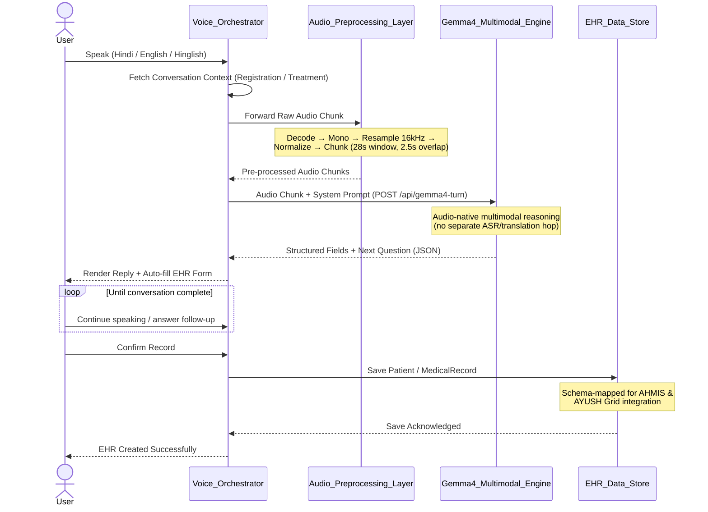
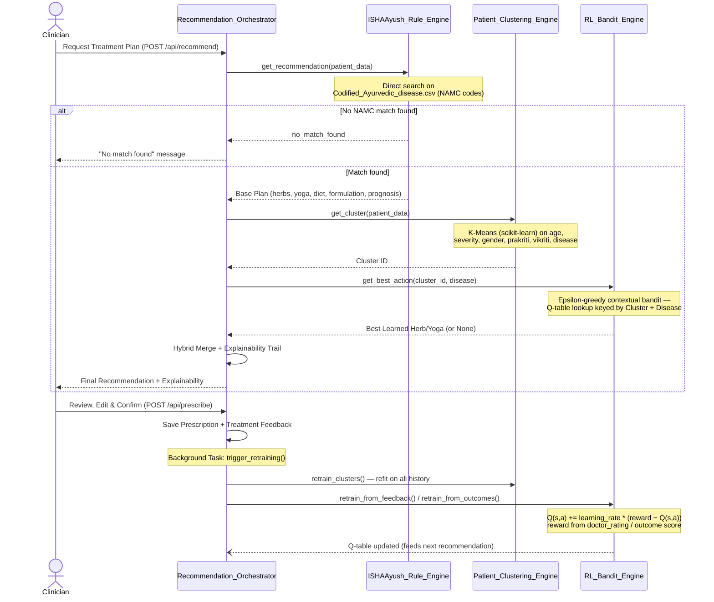
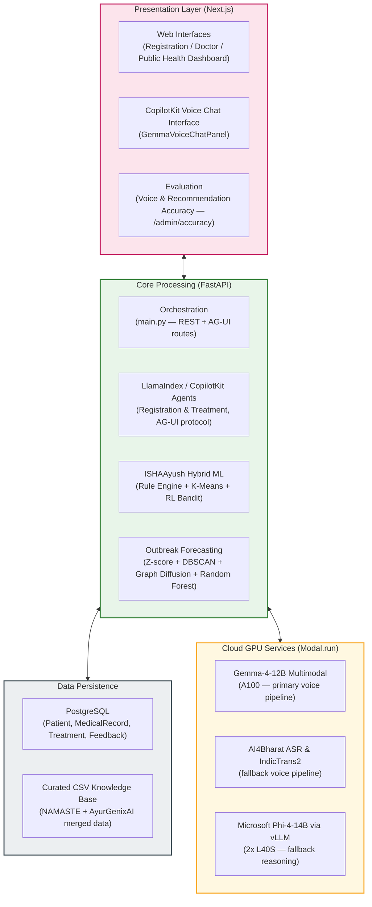

# Hackathon PPT — Working Context

> Purpose: running record of PPT decisions so a new chat can pick up without re-deriving context.
> Update this file every time a slide is finalized or a decision is made.

## Program facts
- IndiaAI Mission hackathon, Problem Statement 3 (Ministry of AYUSH use case).
- Prize pool: ₹25,00,000.
- Full brief: [guidelines.txt](guidelines.txt) (do not edit — source of truth for official wording).
- Deck **structure/flow** is modeled on the team's previous winning deck: [Solution for IDP Challenge.txt](Solution%20for%20IDP%20Challenge.txt) (S4AI, IndiaAI IDP Challenge winner). We reuse its slide *shape*, not its content — that deck was about OCR/document processing, this project is voice/EHR/outbreak/treatment.
- Required content flow per the task brief (build in this order, one stage at a time):
  1. Overview of proposed solution + alignment with Ministry of AYUSH use case
  2. Solution architecture (AI/ML models, tech, system workflow)
  3. Datasets, methodology, key features
  4. Live demonstration

## Ground truth: what's actually built (checked against code, not assumed)
Source: [README.md](README.md), `backend/services/*`, plus a full Explore-agent code audit on 2026-07-04 (verified against actual file contents, not filenames/README alone — README is partly stale). Re-verify if this file gets stale.
- Stack: FastAPI (`backend/main.py`) + Next.js 16/React 19, PostgreSQL (SQLAlchemy models: Patient, MedicalRecord, AyushTreatment, TreatmentFeedback, ClinicalOutcomeScore), CopilotKit + LlamaIndex (AG-UI protocol) agents.
- **Voice pipeline — two paths, one primary:**
  - Primary (default in UI): **Google Gemma-4-12B** multimodal, audio-native — takes raw audio directly in the chat template, no separate ASR/translation hop. Runs on Modal A100. (`modal_gemma4_12b.py`, `GemmaVoiceChatPanel.tsx` defaults to `"gemma4"`.)
  - Fallback path (user-toggleable to "phi4" in UI): AI4Bharat `indic-conformer-600m-multilingual` ASR → AI4Bharat `indictrans2-indic-en-1B` translation → Microsoft **Phi-4-14B** via vLLM on 2× L40S for reasoning/field-extraction.
  - Audio pre-processing (both paths): resampling to 16kHz, normalization, **fixed-time-window chunking** (~20-28s windows, small overlap). **No actual denoising or voice-activity-detection library exists in the repo** (checked: zero hits for webrtcvad/noisereduce/silero-vad) — don't claim VAD/denoising on slides.
  - LLM reasoning is used for conversational field-extraction & summarization only — **not** for generating the final treatment plan text (see below).
- **Personalised Treatment Engine** (`services/hybrid_service.py`, `services/rl_service.py`, `services/patient_clustering_service.py`) — real, not aspirational:
  - Prakriti-based codified rule lookup (ISHAAyush) + **K-Means clustering** (scikit-learn, 10 clusters) on patient demographic/clinical features + **epsilon-greedy contextual bandit** (a real RL method — not deep Q-learning, no state transitions) that upweights herbs/yoga based on clinician feedback (`TreatmentFeedback`, `ClinicalOutcomeScore` tables). `/api/recommend` calls this engine directly — no LLM in the loop for the final plan.
- **Outbreak Forecasting Engine** (`services/gnn_service.py`, `spatial_service.py`, `analytics_service.py`, `disease_forecaster.py`) — real but **not** a trained GNN yet:
  - Anomaly detection = statistical **z-score** on regional case trends.
  - Geospatial clustering = hand-rolled **DBSCAN** (haversine distance), not sklearn.
  - Regional spread = deterministic **graph diffusion over a NetworkX graph** — the code's own comment says explicitly "no trained graph neural network here... Phase 2 will upgrade to a real PyTorch Geometric ST-GNN." **Do not claim a trained/learned GNN is delivered** — describe as graph-based propagation modeling, with a trained ST-GNN as roadmap/Way-Forward item.
  - Per-disease case forecasting = **Random Forest ensemble regression** (`disease_forecaster.py`) — not previously on any slide; directly matches the guideline's "ensemble learning" ask, worth featuring.
  - ARIMA (mentioned in README) is not actually used anywhere in code — don't cite it.
- Focus chronic conditions present in data/prompts: nephrolithiasis, urolithiasis, obesity, hypertension (matches guideline's explicit list).
- No OCR/document-extraction code exists anywhere in this repo — any deck content referencing OCR/table extraction is leftover copy-paste from the old IDP deck and must be removed.
- No live AHMIS / AYUSH Grid integration exists (no access to those systems as a hackathon team) — deck language should say "designed for" / "mapped for" integration, not claim actual integration.
- Deployment: demo runs on Modal.run cloud GPUs for convenience/speed. **Decision (2026-07-04): the "on-prem / air-gapped" claim refers to production deployment on government-provided infra post-selection, not the hackathon demo environment. No contradiction — keep the claim on slides as a deployment capability, not a demo description.**

## Slide-by-slide status

### Slide 1 — Problem Statement — ✅ FINALIZED (2026-07-04)
```
Objective: To develop a secure, scalable, and intelligent AI-powered engine
leveraging Speech-to-Text, NLP, and Hybrid Recommendation systems to automate
EHR creation, forecast regional disease outbreaks, and deliver personalised,
evidence-based AYUSH care.

• Multilingual Voice-Based EHR Creation
• Early Outbreak Detection & Forecasting
• Personalised Treatment & Lifestyle Recommendations

Stage 2 Requirements:
• Enable AYUSH professionals to create structured EHRs on AHMIS using
  voice-based inputs in regional Indian languages, seamlessly translated
  & mapped.
    Target Languages: Multilingual (Major Indian Languages)

• Generate personalised, data-driven treatment plans (herbal, diet, yoga)
  using Prakriti-based logic combined with reinforcement learning on
  clinician feedback & patient outcomes.
    Focus Conditions: Nephrolithiasis, Urolithiasis, Obesity, Hypertension

• Predict short-term regional spread of localised disease surges using
  anomaly detection, geospatial clustering & spatiotemporal graph neural
  networks.
    Core Deliverable: Real-time localised outbreak forecasting & public
    health risk alerts
```
Change from original draft: split the run-on 3-capability line into clean bullets; added a "Focus Conditions" quantifier under the treatment bullet (mirrors IDP deck's "Total Document types: 18" pattern, lifted from guideline's own condition list) so reviewers can checklist-match against the brief.

### Slide 2 — Core Solution — ✅ FINALIZED, then ⚠️ CORRECTED (2026-07-04)
```
Core Solution
Integrated, Scalable AI System for Voice-Based EHR Creation, Outbreak
Early-Warning & Personalised AYUSH Care

• Languages — Hindi, English, Hinglish; extendable to other Indic languages
  by swapping the open-source LLM (no code change)
• Voice-to-EHR Pipeline: Pre-processing (resampling, normalization,
  chunking) → audio-native multilingual LLM understanding (primary path)
  with classical ASR + Indic-English translation as a fallback path →
  structured field extraction into EHR
• Generative Reasoning: LLM-driven structured field extraction &
  consultation summarization from natural voice conversation
• Personalised Treatment Engine: Hybrid recommender — Prakriti-based
  Ayurvedic logic + patient-outcome clustering, continuously refined via
  reinforcement learning on clinician feedback
• Outbreak Forecasting Engine: Anomaly detection + geospatial clustering +
  graph-based spatiotemporal spread propagation, plus per-disease ensemble
  (Random Forest) case forecasting
• Automated accuracy-evaluation pipeline benchmarked on test datasets
• Built on open-source models — deployable fully on-prem / air-gapped for
  complete data sovereignty
```
Change from original draft: **removed** "OCR for handwritten as well as typed documents" and "Extraction of tables, notes, key features" — leftover from the old IDP deck, not applicable to this project. **Added** the Treatment Engine and Outbreak Forecasting Engine bullets, which were completely missing from the original draft despite being 2 of the 3 core pillars. Softened "AHMIS & AYUSH Grid integration" to "mapped for ... integration" since there's no live access to those systems.

**Correction pass (2026-07-04, after code audit):** two bullets overclaimed vs. actual code and were rewritten (see Ground Truth section above for specifics):
1. "Audio denoising, voice-activity detection" → no such code exists; corrected to "Pre-processing (resampling, normalization, chunking)" + honestly describes the dual voice-path (Gemma-4 primary, AI4Bharat/Phi-4 fallback).
2. "Spatiotemporal graph neural network" (as a *delivered* claim) → the code is an untrained graph-diffusion model, not a trained GNN; corrected to "graph-based spatiotemporal spread propagation" and added the real Random Forest ensemble forecaster in its place. (The GNN phrase is still fine on Slide 1 since it quotes the guideline's *ask*, not our delivery.)
3. Also dropped the unconfirmed "prescription/report generation" claim — LLM does field-extraction/summarization only; the treatment plan itself comes from the rule+ML engine, not the LLM.

### Slide 3 — Solution Architecture: AI/ML Models & Methodology — ✅ FINALIZED (2026-07-04)
```
| Category                                     | Model / Methodology                                                                                              |
|-----------------------------------------------|-------------------------------------------------------------------------------------------------------------------|
| Audio Pre-processing                          | Resampling (16kHz), normalization & fixed-window chunking — CPU                                                   |
| Multilingual Voice Understanding               | Google Gemma-4-12B (multimodal, audio-native) — A100 GPU; AI4Bharat IndicConformer ASR + IndicTrans2 as fallback  |
| Conversational Reasoning / Field Extraction    | Microsoft Phi-4-14B via vLLM — 2× L40S GPU                                                                        |
| Patient Clustering                             | K-Means (scikit-learn) on clinical + demographic features                                                         |
| Personalised Treatment Recommendation          | Prakriti-based rule engine + epsilon-greedy contextual bandit (RL), refined via clinician feedback                |
| Outbreak Detection                             | Z-score anomaly detection + DBSCAN geospatial clustering (haversine distance)                                     |
| Regional Spread Forecasting                    | Graph-based spatiotemporal propagation (NetworkX) + Random Forest ensemble regression per disease                 |
| System & Deployment                            | FastAPI + Next.js/React, PostgreSQL; Modal.run GPUs (demo) → on-prem/air-gapped (production)                      |
```
Mirrors the IDP deck's "Category / Model / Methodology" table shape. Every row verified against actual code (not README) via a full Explore-agent audit — see Ground Truth section. Deliberately states Gemma-4-12B as the *primary* voice path with AI4Bharat/Phi-4 as *fallback*, not two parallel features (that's what the code actually does — a UI toggle, default = gemma4).

### Slide 4 — Pipeline Data Flow (2 diagrams) — ✅ FINALIZED, sequence-diagram style (2026-07-04)
User will render these Mermaid diagrams into images themselves. **Format note (2026-07-04):** user provided a reference image (S4AI IDP deck's "Pipeline Data Flow" slide) and asked to match its exact style — Mermaid `sequenceDiagram` with participant lanes, `alt` branch blocks, `Note over` yellow highlight boxes, and self-referencing arrows, rather than `flowchart` boxes-and-arrows. Mermaid's default theme auto-cycles a pastel color per participant lane, which should approximate the reference's multi-color lane look without extra theming.

**Scope decision (2026-07-04):** deck keeps only the Gemma-4 voice/registration diagram (Path A) and the Recommendation Engine diagram (Path B). The AI4Bharat ASR + IndicTrans2 + Phi-4 fallback-path diagram was dropped from the slide — Gemma-4 is the default/primary pipeline being demoed, so the fallback path doesn't need its own deck slide. It's still documented in the Ground Truth section above and in git history if needed later.

**Path A — Gemma-4-12B Multimodal (primary path):**


**Path B — Personalised Treatment Recommendation Engine:**

Verified against `services/ISHAAyush_service.py` (direct substring search on `data/Codified_Ayurvedic_disease.csv`, NAMC codes), `services/patient_clustering_service.py` (sklearn Pipeline: StandardScaler + OneHotEncoder → KMeans, n_clusters=10, persisted as `data/models/patient_cluster_model.pkl`), `services/rl_service.py` (epsilon-greedy contextual bandit, Q-table keyed `"{cluster_id}_{disease}"`, persisted as `data/models/rl_q_table.pkl`, updated via `Q(s,a) += learning_rate * (reward - Q(s,a))` with `learning_rate=0.1, epsilon=0.2`), and `services/hybrid_service.py` (the merge orchestrator). Closed loop confirmed via `main.py`: `/api/prescribe` → `background_tasks.add_task(trigger_retraining)` → calls `clustering_service.retrain_clusters()` + `rl_service.retrain_from_feedback()` + `rl_service.retrain_from_outcomes()`. This is the strongest "continuously learns from clinician feedback" evidence in the whole codebase — worth emphasizing verbally in the demo.

### Slide 5 — System Architecture (component diagram) — ✅ FINALIZED (2026-07-04)
User provided a reference image (styled after the existing `README.md` architecture diagram — 4 colored subgraph boxes: Presentation Layer / Core Processing / Data Persistence / Cloud GPU Services) and asked for a diagram in that visual style, built with the same verification rigor as the Slide 4 sequence diagrams (i.e., checked against current code, not copied from the stale README diagram, which still says "ARIMA + GNN" and omits Gemma-4-12B).

Verified placement of "Evaluation" via git history: `src/app/admin/accuracy/page.tsx` + `backend/services/admin_router.py` (commits `a29dd6e`, `1ebefb9`) — a real admin accuracy-evaluation page, not aspirational. Corrections vs. the reference's underlying (stale) architecture: replaced "ARIMA & Deterministic graph diffusion" with the actual verified methods (Z-score + DBSCAN + Graph Diffusion + Random Forest — no ARIMA anywhere in code); added Gemma-4-12B as its own Cloud GPU Services box since it's the primary voice model, not a footnote; labeled the ML box "ISHAAyush Hybrid ML" to reflect the full rule+cluster+RL engine, not just the base rule engine.

### Slide 6 — Datasets & Methodology — ✅ FINALIZED (2026-07-04)
```
Datasets

• NAMASTE Portal (Ministry of AYUSH) — official National AYUSH
  Morbidity & Standardized Terminologies source
    2,910 standardized NAMC codes (Ayurveda / Siddha / Unani),
    WHO-ICD-10 & ICD-11 aligned, in English + Devanagari

• AyurGenixAI Ayurvedic Dataset — curated clinical-Ayurveda
  knowledge base
    446 diseases → herbs, formulations, yoga & physical therapy,
    diet & lifestyle, dosha/prakriti profiles, prognosis & complications

Methodology

• Disease cross-mapping: AyurGenixAI diseases matched onto NAMASTE
  NAMC codes via Exact String → Substring → Fuzzy matching — every
  treatment recommendation traceable to an official standardized code
• Retrieval-based recommendation (not generative): every herb/yoga/diet
  suggestion is sourced verbatim from curated data — zero hallucination
  risk in a clinical setting
• Fuzzy disease-name search: character n-gram TF-IDF + cosine
  similarity for doctor-facing autocomplete
• Personalisation layer: Prakriti/Vikriti dosha logic + K-Means patient
  clustering + reinforcement-learning feedback loop (see Recommendation
  Engine, Slide 4)

Key Features

• Full traceability — NAMC code + Devanagari term cited with every
  recommendation
• Explainability trail — dosha reasoning, predicted improvement %, and
  dataset provenance returned with every plan
• Continuously improves — clinician feedback & patient outcomes retrain
  the clustering + RL layers in a closed loop
```
Sources: user-provided links — NAMASTE portal (https://namaste.ayush.gov.in/ayurveda, confirmed via WebFetch: official Ministry of AYUSH "National Ayush Morbidity and Standardized Terminologies Electronic Portal," WHO-ICD-10/11 aligned) and AyurGenixAI Kaggle dataset (https://www.kaggle.com/datasets/kagglekirti123/ayurgenixai-ayurvedic-dataset — page is JS-rendered, couldn't verify stats directly via WebFetch; 446-disease figure confirmed by user, matches stale internal docs `backend/docs/AyurGenixAI_Model_Report.md`/`AyurGenixAI_OnePager.md`).

**Internal note — NOT for the slide, user's explicit call (2026-07-04):** actual measured merge coverage in `backend/data/Codified_Ayurvedic_disease.csv` is only **297 of 2,910 NAMASTE rows (≈10%) have merged AyurGenixAI treatment content, corresponding to 97 unique diseases** (Exact String: 33, Substring Match: 141, Fuzzy Match: 123 — computed directly via pandas). User was shown this gap and explicitly chose to state only the 2,910 total on the slide without surfacing the 297/97 detail. Keep this number here so the team has the real figure on hand if a reviewer probes during Q&A — don't get caught flat-footed by your own slide.

Also confirmed stale vs. current code: `AyurGenixAI_Model_Report.md`/`OnePager.md` describe an **older engine version** (446-disease `ISHAAyushAI_Dataset.csv`, 4-tier TF-IDF symptom matching, `/api/ml/recommend` endpoint) that no longer exists in `backend/data/`. Current live `ISHAAyush_service.py` does direct substring search on the NAMASTE-merged CSV instead — the slide above describes the **current** method, not the stale docs' method. The TF-IDF piece that *is* still live is `get_suggestions()` — character n-gram (2-3) TF-IDF + cosine similarity, used only for disease-name autocomplete, not the recommendation match itself.

### Slide — Live Demo flow/script — ⬜ NOT STARTED
### Slide — Team/Contact (if following IDP deck template) — ⬜ NOT STARTED

## Open questions / things to confirm with user before finalizing later slides
- Any real accuracy/evaluation numbers to cite (IDP deck cited CER, hallucination rate, throughput) — check `Voice_Pipeline_Accuracy_Evaluator` work (git log, commit a29dd6e) for numbers once we get to the Datasets/Methodology slide.
- Team member names/roles/contact info for a closing slide (IDP deck had this) — not yet discussed.
- Whether to visually diagram the dual voice-path (Gemma-4 primary / AI4Bharat+Phi-4 fallback) on the Pipeline Data Flow slide, or keep it simple and mention fallback only verbally in the demo.

## Working style notes
- Do not invent capabilities not present in code. Always spot-check claims against `backend/services/*` before adding to a slide.
- Government-reviewer psychology to keep optimizing for: concrete quantifiers over vague adjectives, explicit brief-language mirroring (shows comprehension), open-source/data-sovereignty messaging (no vendor lock-in), clean checklist-able bullets over dense paragraphs.
- Work one slide/section at a time; don't jump ahead in the deck flow.
