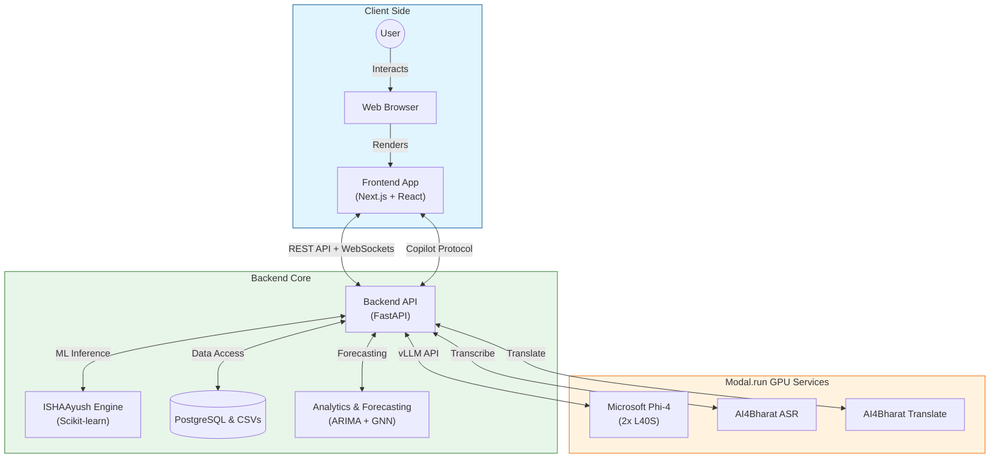
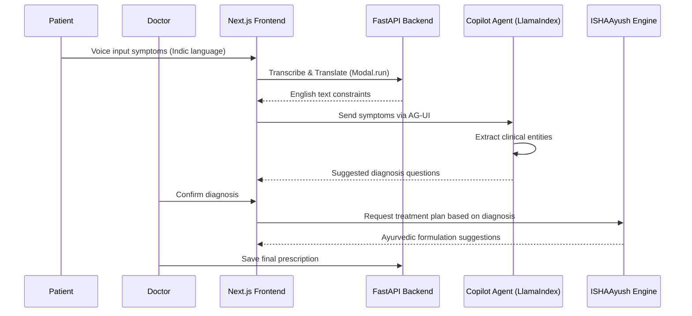
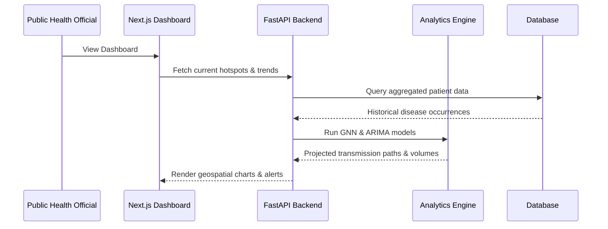

# ISHA-AYUSH — Ayurvedic Healthcare & Public Health Surveillance Platform

## Executive Summary

**ISHA-AYUSH** is an AI-powered Ayurvedic healthcare platform that integrates traditional AYUSH knowledge with modern ML. It provides end-to-end capabilities covering patient registration, AI-driven clinical consultation (using CopilotKit and LlamaIndex), treatment planning (ISHAAyush engine), and public health surveillance via spatiotemporal GNN and ARIMA forecasting.

By combining **Microsoft Phi-4** (via vLLM on Modal.run), **AI4Bharat** (ASR and translation for multilingual Indic voice support), and a **FastAPI/Next.js** stack, ISHA-AYUSH democratizes access to personalized Ayurvedic care while enabling proactive disease monitoring at scale.

---

## 1. Problem Statement & Solution Capabilities

### The Challenge

Traditional Ayurvedic healthcare faces several challenges in scaling and standardizing care:

- **Accessibility**: Patients in rural areas face language barriers and limited access to expert Ayurvedic practitioners.
- **Knowledge Integration**: Ayurvedic knowledge is vast, making it challenging to standardize treatment plans across practitioners.
- **Public Health Monitoring**: Lack of real-time, data-driven surveillance for emerging disease trends and outbreaks.

### Our Solution

1. **Intelligent Multilingual Voice Input**: Leverages AI4Bharat ASR and translation, allowing patients and practitioners to interact using various Indic languages natively.
2. **AI Copilot Agents**: Three specialized agents (Registration, Consultation, Treatment) powered by CopilotKit and LlamaIndex for conversational, guided workflows.
3. **ISHAAyush Treatment Recommendation**: Scikit-learn based ML engine generating personalized Ayurvedic treatment plans based on a curated `ISHAAyushAI_Dataset.csv` knowledge base.
4. **Public Health Surveillance**: Analyzes clinical data to detect geographical disease hotspots and forecast outbreaks using ARIMA and Spatiotemporal Graph Neural Networks (GNN).
5. **Role-Based Workflows**: Tailored, intuitive Next.js web applications for Receptionists, Doctors, and Public Health Officials.
6. **Cloud-Accelerated Inference**: Heavy ML workloads like the Phi-4 model and ASR are deployed on Modal.run serverless GPU infrastructure for high performance and low latency.

---

## 2. System Architecture

### High-Level Architecture



### Core Workflows

#### A. Patient Consultation Flow



#### B. Public Health Forecasting



---

## 3. Technical Architecture

### 3.1 Backend (FastAPI)

The orchestration engine handles APIs, Copilot agents, and integrates machine learning endpoints.

**Core Services:**

| Service | Description |
|---|---|
| `ISHAAyushService` | ML-driven treatment recommendation engine using historical datasets |
| `ConsultationAgent` | Copilot-based agent for clinical assessment and diagnosis guidance |
| `ForecastService` | Disease forecasting using ARIMA and trend algorithms |
| `GNNService` | Spatiotemporal Graph Neural Network for disease spread mapping |
| `CSVService` | Data ingestion and persistence layer mapping to PostgreSQL |

**Key API Endpoints:**

| Endpoint | Description |
|---|---|
| `POST /api/patients` | Register a new patient |
| `POST /api/consultations` | Record a new consultation (visit) |
| `POST /api/recommend` | Get AI treatment recommendation |
| `POST /api/prescribe` | Save doctor's final prescription |
| `GET /api/forecast` | Disease forecast mapping |
| `GET /api/analytics/hotspots` | Loc2ation-based disease hotspots |
| `POST /api/copilot/consultation/...` | CopilotKit consultation agent runtime |

### 3.2 Cloud Infrastructure (Modal.run)

To ensure low latency for heavy ML tasks, specialized models are hosted on Modal:

| Service | GPU Configuration | Purpose |
|---|---|---|
| **Microsoft Phi-4** | 2× L40S | LLM reasoning base via vLLM for Copilot agents |
| **AI4Bharat ASR** | T4 / A10G | Speech-to-text for multilingual voice input |
| **AI4Bharat Transl** | T4 / A10G | Indic ↔ English translation loop |

### 3.3 Frontend (Next.js)

A modern, responsive healthcare portal powered by Next.js App Router and shadcn/ui.

**Key Views:**

| Page | Description |
|---|---|
| **Registration (`/registration`)** | Copilot-assisted patient onboarding queue |
| **Doctor (`/doctor`)** | AI copilot clinical evaluation and patient history |
| **Treatment (`/doctor/treatment/[id]`)** | ISHAAyush treatment generation and prescription confirmation |
| **Dashboard (`/public-health/dashboard`)** | Global incidence tracking, spatial GNN charts, and active alerts |

---

## 4. Getting Started

### Prerequisites

- Python 3.10+
- Node.js 18+
- PostgreSQL (running locally)
- Modal auth token (if deploying cloud endpoints)

### Backend Setup

```bash
cd backend

# Create and activate virtual environment
python3 -m venv venv
source venv/bin/activate

# Install dependencies
pip install -r requirements.txt

# Configure environment
cp .env.example .env

# Seed the initial database
python migrate_csv_postgres.py

# Start the FastAPI server
python main.py
```

API runs on `http://localhost:8000`. Full docs at `http://localhost:8000/docs`.

### Frontend Setup

```bash
# From project root
npm install

# Configure environment variables
cat > .env.local << 'EOF'
NEXT_PUBLIC_API_URL=http://localhost:8000
PYTHON_BACKEND_URL=http://localhost:8000
NEXT_PUBLIC_COPILOT_URL=/api/copilotkit

# Modal endpoints (Update with deployed URLs)
MODAL_ASR_URL=https://<your-modal-asr-endpoint>/transcribe
MODAL_TRANSLATE_URL=https://<your-modal-translate-endpoint>/translate
EOF

# Start Next.js development server
npm run dev
```

Portal available at `http://localhost:3000`.

### Full-Stack Setup (One-Shot)

```bash
chmod +x setup.sh
./setup.sh
```

This will:
1. Create and populate the Python virtual environment
2. Install Node.js dependencies
3. Create `.env.local` if not present

---

## 5. Configuration

Key environment settings across backend (`.env`) and frontend (`.env.local`):

| Variable | Scope | Description |
|---|---|---|
| `LLM_BINDING` | Backend | Model backend: `vllm` (Phi-4) or `openai` (GPT-4o) |
| `VLLM_API_HOST` | Backend | Modal endpoint if `LLM_BINDING=vllm` |
| `OPENAI_API_KEY` | Backend | Fallback or primary logic depending on LLM binding |
| `DATABASE_URL` | Backend | PostgreSQL connection string |
| `NEXT_PUBLIC_API_URL` | Frontend | Target backend API location |
| `MODAL_ASR_URL` | Frontend | External endpoint for AI4Bharat text extraction |

---

## 6. Evaluation & Accuracy

System accuracy and model alignment can be evaluated via administrative endpoints:
- **`GET /api/admin/accuracy`**: Compares ML-suggested treatment plans against historical doctor feedback (from `treatment_feedback.csv`).
- LLM calls are tracked and logged in `backend/logs/model_interactions/` to analyze Copilot step progression and prompt efficiency over time.

---

## 7. Project Structure

```text
ayush-app/
├── backend/
│   ├── main.py                 # FastAPI router entry
│   ├── services/               # Business logic (ISHAAyush, GNN, Forecasting)
│   ├── data/                   # Core structured knowledge base (.csv)
│   ├── modal_asr/              # Scripts to deploy vLLM, ASR to Modal.run
│   └── utils/
│       ├── agent/              # CopilotKit backend orchestration
│       └── llm_logger.py       # I/O compliance tracer
├── src/
│   ├── app/                    # Next.js App Router endpoints
│   ├── components/             # Reusable React components (shadcn/ui, Recharts)
│   ├── lib/                    # Configuration, hooks, API fetchers
│   └── types/                  # Shared TypeScript interfaces
└── setup.sh                    # Unified startup sequence
```

---

## 8. Key Technology Choices

| Technology | Role |
|---|---|
| **FastAPI** | High-performance async Python backend |
| **Next.js & React 19** | Server-side rendered interfaces and React Server Components |
| **CopilotKit** | Headless agent UI components linking React with LlamaIndex |
| **LlamaIndex** | RAG and multi-agent workflow orchestration |
| **Microsoft Phi-4** | Lean, highly capable open LLM optimized via vLLM |
| **Modal.run** | Serverless GPU hosting for fast inference without idle costs |
| **NetworkX & scikit-learn** | Backbone of geographic mapping and clinical recommendation |
| **PostgreSQL** | Primary relational datastore for medical events and users |

**Built by**: S4AI Technologies LLP
