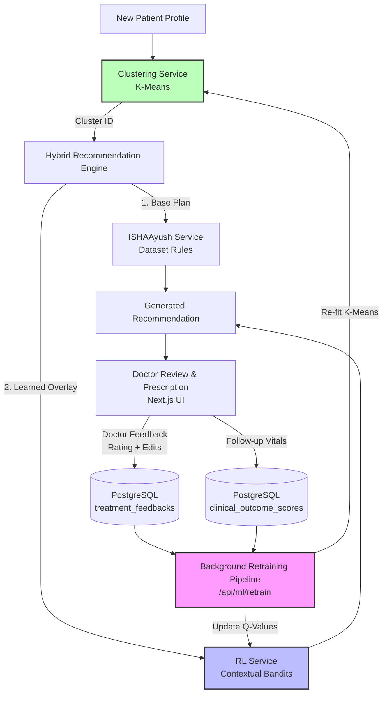

# AYUSH India AI — Model Learning & Feedback Loop

This document provides a technical explanation of how the **ISHAAyush AI** recommendation system learns from historical treatments, clinician feedback, and patient outcomes, and how it applies this learning dynamically to upcoming patients.

---

## 1. The Need for Continuous Learning in Healthcare

Static recommendation systems rely strictly on expert-curated medical guidelines (e.g., matching a patient's disease directly to a pre-defined set of herbs). While safe, these static systems cannot:
1. **Adapt** to real-world clinical variations.
2. **Learn** which auxiliary herbs or yoga practices perform best for specific subsets of patients.
3. **Incorporate** clinician feedback (i.e., if a doctor modifies a recommendation, the AI should learn from that correction).

To bridge this gap, ISHAAyush AI implements a **Continuous Feedback Loop** combining **Patient Clustering** (K-Means) and **Reinforcement Learning** (Epsilon-Greedy Contextual Bandits).

---

## 2. Architecture & Data Flow

The continuous learning system forms a complete cycle, starting with clinical recommendations and closing with outcome-driven model updates.

---

## 3. How the System Learns: Core Components

The learning workflow is divided into three key steps: patient categorization, reward evaluation, and model retraining.

### 3.1 Step 1: Contextual Categorization (Clustering)
Instead of learning a separate rule for every individual patient (which leads to data sparsity) or treating all patients identically, the system groups patients into **Clinical Clusters**.

*   **Implementation:** [clustering_service.py](file:///Volumes/z21techssd/Python/ayush-indiaai/backend/services/clustering_service.py)
*   **Algorithm:** K-Means Clustering ($k=10$).
*   **Features Used:**
    *   *Numeric:* Age, Severity (1–10).
    *   *Categorical (One-Hot Encoded):* Gender, Prakriti (constitution), Vikriti (imbalance), Disease.
*   **Role:** When a recommendation request arrives, `clustering_service.get_cluster()` classifies the patient profile into a `cluster_id`. This `cluster_id` represents the patient's ML "state".

> [!NOTE]
> **Why $k = 10$?**
> The selection of $k = 10$ is a hyperparameter design decision for this Proof-of-Concept (PoC) balancing **granularity** and **data density**:
> 1. **Data Density / Mitigating Sparsity:** A smaller $k$ groups more patients together. Since reinforcement learning state space is `ClusterID_DiseaseName`, too many clusters (e.g. $k=100$) would fragment feedback data. By capping $k=10$, we ensure the model receives enough feedback per cluster to update Q-values quickly.
> 2. **Clinical Granularity:** $k=10$ is sufficient to capture the main cohort archetypes across age groups, severities, and Prakriti/Vikriti profiles without over-segmenting.
> 3. **Bootstrapping Threshold:** The clustering model requires a minimum of $k$ historical records to train (`len(data) < self.n_clusters`). Setting $k=10$ allows the system to begin continuous learning very early in the deployment life cycle.
> 
> *Future Work:* As the patient database grows to thousands of records, $k$ can be tuned dynamically using validation metrics like the **Elbow Method** or **Silhouette Coefficient**.

---

### 3.2 Step 2: Double-Pathway Reward Signals
Learning is driven by two distinct feedback loops, each providing a numerical **Reward** ($R$) back to the reinforcement learning model.

#### Pathway A: Clinician Feedback (Subjective)
When a doctor reviews the generated treatment plan, they can approve it, modify it, and provide a rating.
*   **Database Table:** `treatment_feedbacks` ([models.py](file:///Volumes/z21techssd/Python/ayush-indiaai/backend/models.py))
*   **Reward Mapping:**
    *   `positive` $\rightarrow R = +1.0$
    *   `negative` $\rightarrow R = -1.0$
    *   `neutral`/missing $\rightarrow R = 0.0$

#### Pathway B: Objective Clinical Outcomes (Mathematical)
When a patient returns for a follow-up, the system compares their baseline vitals (e.g., blood sugar, blood pressure) to follow-up values.
*   **Database Table:** `clinical_outcome_scores` ([models.py](file:///Volumes/z21techssd/Python/ayush-indiaai/backend/models.py))
*   **Reward Mapping:**
    *   The reward is directly proportional to the percentage change in the target vital.
    *   Example: A $20\%$ drop in HbA1c yields a calculated reward ($R > 0$).

---

### 3.3 Step 3: Q-Table Model Retraining (Q-Learning / Contextual Bandits)
When a retraining run is triggered (via endpoint `/api/ml/retrain`), the background pipeline processes all unprocessed feedback and clinical outcomes.

*   **State ($s$):** A combination of the patient's cluster ID and the disease name:
    $$s = \text{`{cluster_id}_{disease_clean}`}$$
*   **Actions ($a$):** The individual herbs prescribed or yoga practices suggested:
    $$a \in \{ \text{Herb Names}, \text{`yoga:{PracticeName}`} \}$$
*   **Q-Table ($Q(s,a)$):** A dictionary mapping `q_table[state][action] = q_value` representing the historical effectiveness of action $a$ in state $s$.
*   **Update Rule:**
    For each action taken in the plan, the Q-value is updated using the Temporal Difference update rule:
    $$Q(s, a) \leftarrow Q(s, a) + \alpha \cdot (R - Q(s, a))$$
    Where:
    *   $\alpha$ is the **Learning Rate** (default: `0.1`), which controls how fast new feedback overrides old knowledge.
    *   $R$ is the reward received ($+1.0$, $-1.0$, or the vital outcome score).

---

## 4. How Learning is Applied to Upcoming Patients

When a doctor requests a recommendation for a **new patient**, the engine executes the **Hybrid Recommendation Engine** ([hybrid_service.py](file:///Volumes/z21techssd/Python/ayush-indiaai/backend/services/hybrid_service.py)).

### 4.1 Step 1: Base Rules Execution
The system fetches the primary, static recommendations (herbs, yoga, diet) for the diagnosed disease and Prakriti/Vikriti from the vetted medical dataset `ISHAAyushAI_Dataset.csv` using the [ISHAAyush_service.py](file:///Volumes/z21techssd/Python/ayush-indiaai/backend/services/ISHAAyush_service.py) 4-tier matching algorithm.

### 4.2 Step 2: State Identification
The patient's current profile is sent to `clustering_service.get_cluster(patient_profile)` which returns their `cluster_id`. The engine constructs the state key:
$$s = \text{`{cluster_id}_{disease}`}$$

### 4.3 Step 3: Reinforcement Learning Query (Epsilon-Greedy)
The engine queries the RL agent to find if there are any learned actions for this specific state. The action selector uses the **$\epsilon$-Greedy (Epsilon-Greedy)** strategy:

1.  **Exploration (Probability $\epsilon = 0.2$):**
    With a $20\%$ probability, the model tries a random action (a new herb or yoga practice) to discover whether it performs better than known treatments.
2.  **Exploitation (Probability $1 - \epsilon = 0.8$):**
    With an $80\%$ probability, the model retrieves the action $a$ that has the **maximum Q-value** in the Q-table for state $s$:
    $$a^* = \arg\max_a Q(s, a)$$
    *Note: The system only returns the action if $Q(s, a^*) > 0$ (confirming it has positive historical support).*

### 4.4 Step 4: Hybrid Merging
If the RL agent recommends a learned herb or yoga practice that is not already in the static base plan, the hybrid engine inserts it at the beginning of the list and adds explainability markers:

> **AI Recommendation Overlay:**
> *   **Action Added:** Triphala
> *   **Benefits:** *AI Discovered: Highly effective for Cluster 3 with Diabetes.*
> *   **Explainability Rationale:** *Added Triphala based on positive clinician feedback for similar patients.*

---

## 5. Summary of Code & File References

| File Name | Class / API | Responsibility |
| :--- | :--- | :--- |
| [models.py](file:///Volumes/z21techssd/Python/ayush-indiaai/backend/models.py) | `TreatmentFeedback`, `ClinicalOutcomeScore` | PostgreSQL tables for storing clinician ratings and vitals outcomes. |
| [clustering_service.py](file:///Volumes/z21techssd/Python/ayush-indiaai/backend/services/clustering_service.py) | `PatientClusteringService` | Trains K-Means clustering; groups similar patients into 10 distinct cohorts. |
| [rl_service.py](file:///Volumes/z21techssd/Python/ayush-indiaai/backend/services/rl_service.py) | `RLRecommendationService` | Implements the Epsilon-Greedy Contextual Bandits Q-table, saving state-action weights, and updates values from rewards. |
| [hybrid_service.py](file:///Volumes/z21techssd/Python/ayush-indiaai/backend/services/hybrid_service.py) | `HybridRecommendationEngine` | Integrates base retrieval with RL overlays to generate a final customized plan. |
| [main.py](file:///Volumes/z21techssd/Python/ayush-indiaai/backend/main.py) | `/api/feedback`, `/api/ml/retrain` | FastAPI routes that record clinician feedback and trigger model training runs in the background. |
