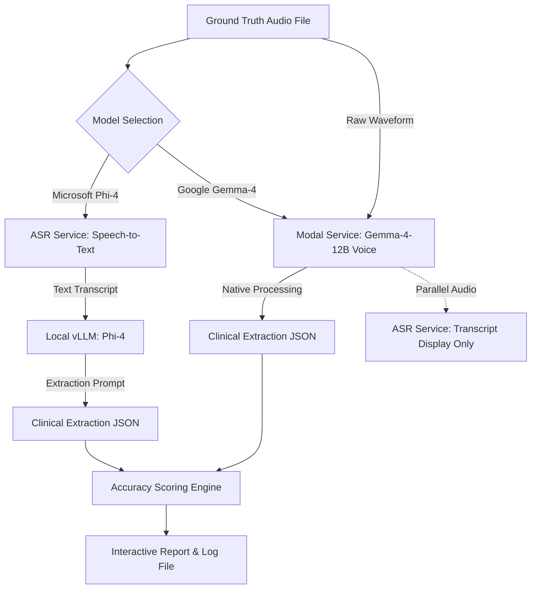

# Voice Pipeline Accuracy Evaluator

The **Voice Pipeline Accuracy Evaluator** is a clinical validation and automated benchmarking tool within the AYUSH EHR system. It allows clinical administrators and AI engineers to evaluate and compare different Large Language Models (LLMs) and pipeline configurations on their ability to transcribe and extract structured clinical data from doctor-patient voice consultations.

---

## 1. Executive Summary & Business Value

In a fast-paced clinical environment, voice-to-data entry drastically reduces the documentation burden on doctors. However, to ensure medical safety and record reliability:
* **Clinical Accuracy is Critical**: Extracted terms (diseases, symptoms, Doshas, and Prakriti) must align with the doctor's spoken notes.
* **Continuous Benchmarking is Required**: As models are updated or custom fine-tuned, developers must perform regression testing to ensure no decrease in clinical extraction quality.
* **Model Selection Optimization**: The evaluator allows direct side-by-side performance comparison between different LLM pipelines—specifically, **Microsoft Phi-4 (ASR + Local text extraction)** vs. **Google Gemma-4 (Native audio understanding)**.

---

## 2. Core Pipelines & Architecture

The evaluator supports two alternative pipelines to extract clinical terms from raw audio:

### Pipeline A: Microsoft Phi-4 (Two-Step Pipeline)
This pipeline decouples speech recognition from clinical text parsing:
1. **ASR (Speech-to-Text)**: The audio file is posted to a Modal-hosted speech recognition service (`MODAL_ASR_URL`), yielding a text transcript.
2. **Clinical Extraction**: The transcript text is fed to a local Open-Source vLLM server running `microsoft/phi-4` with an extraction prompt. The model outputs a clinical JSON object.

### Pipeline B: Google Gemma-4 (Native Voice Pipeline)
This pipeline takes advantage of native multimodal speech models:
1. **Native Audio Processing**: The raw audio file is sent directly to the Modal-hosted `google/gemma-4-12B` voice endpoint (`MODAL_GEMMA_URL`).
2. **End-to-End Extraction**: Gemma-4 processes the audio waveform directly without a separate speech-to-text stage, outputting the structured clinical fields natively.
3. **Display Transcript**: In parallel, the evaluator runs speech-to-text to display the text transcript in the final evaluation report solely for user/doctor readability.

### Architecture Diagram



---

## 3. Ground Truth Dataset

The benchmark is run against a pre-validated dataset stored in `src/data/ground_truth.json`. This dataset contains a series of reference entries mapping patient voice clips to validated AYUSH diagnoses and symptoms.

### Sample Ground Truth Schema
```json
[
  {
    "Audio-file name": "hindi_asthma_patient.wav",
    "Disease": "Asthma",
    "Symptoms": ["breathlessness", "wheezing", "dry cough"],
    "Prakriti": "Vata-Kapha",
    "Doshas": "Kapha"
  }
]
```

---

## 4. Scoring Engine & Logic

The scoring engine measures the extraction quality against the ground truth parameters. Each parameter has a relative weight reflecting its clinical diagnostic significance.

### Weight Distribution Table

| Clinical Field | Scoring Type | Weight | Description |
| :--- | :--- | :---: | :--- |
| **Disease** | Fuzzy Matching | 40% | Measures how close the diagnosis is to the ground truth string using SequenceMatcher ratio. |
| **Symptoms** | Sub-string Recall | 40% | Evaluates the proportion of ground truth symptoms identified in the extracted text. |
| **Doshas (Vikriti)** | Exact Matching | 10% | Binary evaluation of matching current state imbalance (Vata / Pitta / Kapha). |
| **Prakriti** | Exact Matching | 10% | Binary evaluation of matching core constitution (Vata / Pitta / Kapha etc.). |

### Detailed Formulation

1. **Disease Score ($S_D$)**:
   $$S_D = \text{SequenceMatcherRatio}(\text{GroundTruthDisease}, \text{ExtractedDisease}) \times 100$$
   *(Example: "Asthma" vs "Bronchial Asthma" yields a partial fuzzy ratio).*

2. **Symptoms Score ($S_S$)**:
   - Let $G$ be the set of ground truth symptoms.
   - Let $E$ be the set of extracted symptoms.
   - If both lists are empty: $S_S = 100$.
   - Otherwise:
     $$S_S = \left( \frac{\text{Count of } g \in G \text{ partially present in } E}{|G|} \right) \times 100$$

3. **Dosha Score ($S_{Do}$)** & **Prakriti Score ($S_P$)**:
   - Exact string match after lowercasing and trimming:
     - Match = 100
     - Mismatch = 0

4. **Total Score ($S_{Total}$)**:
   $$S_{Total} = (S_D \times 0.4) + (S_S \times 0.4) + (S_{Do} \times 0.1) + (S_P \times 0.1)$$

### Performance Category Badges
* **Match ($\ge 80\%$)**: Safe, reliable clinical match. Displays as a green badge in the UI.
* **Partial Match ($50\% - 79\%$)**: Incomplete clinical extraction. Displays as an amber badge.
* **Mismatch ($< 50\%$)**: High diagnostic failure rate. Displays as a red badge.

---

## 5. Streaming Real-Time Execution

Running evaluations sequentially can take a few minutes. To prevent UI lockups and keep users engaged:
* **Server-Sent Events (SSE)**: The `/api/admin/evaluate-voice` endpoint uses FastAPI's `StreamingResponse` to push real-time events.
* **Event Protocol**:
  - `progress`: Emits file counts and completion percentages (e.g., `{"type": "progress", "current": 2, "total": 10, "percent": 20}`).
  - `complete`: Emits the final report structure containing all comparative results.
  - `error`: Emits detail in case of failure.

---

## 6. Evaluation Reports & Logs

Every completed evaluation run is serialized and saved in the backend storage directory:
`backend/logs/evaluations/voice_eval_{model}_{timestamp}.json`

This ensures that historical performance logs are maintained, allowing teams to audit model improvements over time.
