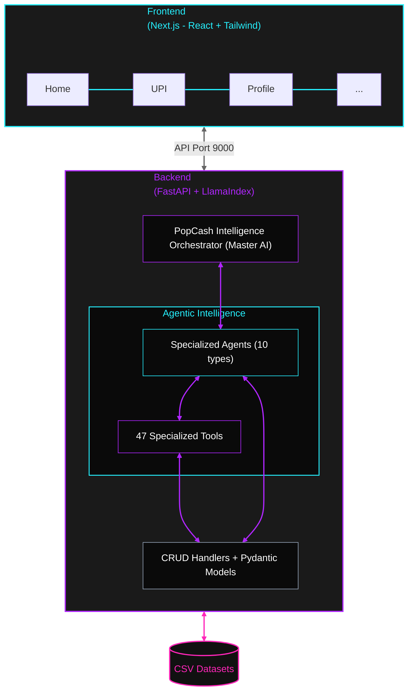

# PopCash - Intelligent Rewards & Payments Platform

PopCash is an intelligent rewards and payments platform that helps users maximize their popCoins (loyalty rewards) through AI-powered assistance. The platform combines a FastAPI-based **Intelligence Orchestrator** with specialized AI agents and a **mobile-first Next.js 16 frontend** to provide personalized financial insights, smart redemption recommendations, and gamified user engagement.

---

## 📋 Table of Contents

- [Project Overview](#project-overview)
- [Architecture](#architecture)
- [Setup Instructions](#setup-instructions)
  - [Backend Setup](#backend-setup)
  - [Frontend Setup](#frontend-setup)
- [Running the Application](#running-the-application)
- [Data Entities](#data-entities)
- [AI Tools & Agents](#ai-tools--agents)
- [Use Cases](#use-cases)
- [Project Structure](#project-structure)
- [API Reference](#api-reference)

---

## 🎯 Project Overview

PopCash is a comprehensive rewards platform that:
- **Tracks user transactions** across multiple payment methods (UPI, Credit Card, Debit Card, Bill Payments)
- **Manages popCoins** - loyalty points that users earn and redeem for products
- **Provides AI-powered recommendations** through 10 specialized agent systems
- **Gamifies the experience** with challenges, goals, and achievements
- **Offers budget insights** and spending analytics

---

## 🏗️ Architecture

### Technology Stack

#### Backend
- **Framework**: FastAPI (Python)
- **AI/LLM**: LlamaIndex + OpenAI (GPT-4o-mini)
- **Data Models**: Pydantic
- **Data Storage**: CSV-based datasets (16 data entities)
- **Agent Framework**: Custom ReActAgent with tool-based interaction

#### Frontend
- **Framework**: Next.js 16 + React 19
- **Build Tool**: Turbopack
- **AI Integration**: CopilotKit
- **Styling**: TailwindCSS 4
- **UI Components**: Lucide React + React Icons
- **Charts**: Recharts

### System Components




```
┌─────────────────────────────────────────────────────────────┐
│          Frontend (Next.js - React + Tailwind)              │
│    ┌──────────┐ ┌──────────┐ ┌──────────┐ ┌──────────┐      │
│    │   Home   │ │    UPI   │ │ Profile  │ │   ...    │      │
│    └──────────┘ └──────────┘ └──────────┘ └──────────┘      │
└─────────────────────────────────────────────────────────────┘
                              │
                              ▼
┌─────────────────────────────────────────────────────────────┐
│              Backend (FastAPI + LlamaIndex)                 │
│   ┌─────────────────────────────────────────────────────┐   │
│   │    PopCash Intelligence Orchestrator (Master AI)    │   │
│   └─────────────────────────────────────────────────────┘   │
│                              │                              │
│         ┌────────────────────┴─────────────────────┐        │
│         ▼                                          ▼        │
│   ┌──────────────┐                         ┌──────────────┐ │
│   │ Specialized  │                         │   47 Tools   │ │
│   │   Agents     │                         │  (17 Data +  │ │
│   │  (10 types)  │◄────────────────────────│  7 Analytics │ │
│   └──────────────┘                         │  + 23 Action)│ │
│         │                                  └──────────────┘ │
│         ▼                                          │        │
│   ┌──────────────────────────────────────────────────────┐  │
│   │           CRUD Handlers + Pydantic Models            │  │
│   └──────────────────────────────────────────────────────┘  │
│                              │                              │
└──────────────────────────────┼──────────────────────────────┘
                               ▼
                   ┌──────────────────────┐
                   │   CSV Datasets       │
                   │   (16 entities)      │
                   └──────────────────────┘
```

---

## 🚀 Setup Instructions

### Prerequisites
- **Python**: 3.9 or higher
- **Node.js**: 18 or higher
- **npm**: 9 or higher
- **OpenAI API Key**: Required for AI agent functionality

### Backend Setup
For detailed backend architecture and setup, see [backend/README.md](/backend/README.md).

1. **Navigate to backend directory**:
   ```bash
   cd backend
   ```

2. **Setup environment**:
   `uv` will automatically handle environment creation during sync. Ensure `uv` is installed on your system.

3. **Install dependencies**:
   ```bash
   uv sync
   ```

4. **Configure environment variables**:
   - Copy `.env.sample` to `.env`:
     ```bash
     cp .env.sample .env
     ```
   - Edit `.env` and add your OpenAI API key:
     ```
     LLM_BINDING=openai
     LLM_MODEL=gpt-4o-mini
     OPENAI_API_HOST=https://api.openai.com/v1
     OPENAI_API_KEY=your_api_key_here
     ```

5. **Verify data files**:
   - Ensure all 16 CSV files are present in `backend/dataset/` directory

### Frontend Setup
For detailed frontend features and component overview, see [frontend/README.md](/frontend/README.md).

1. **Navigate to frontend directory**:
   ```bash
   cd frontend
   ```

2. **Install dependencies**:
   ```bash
   npm install
   ```

3. **Configure environment** (if needed):
   - The frontend is configured to connect to backend at `localhost:9000` by default
   - Modify API endpoints in source files if using different configuration

---

## ▶️ Running the Application

### Start Backend Server

```bash
cd backend
uv run python main.py
```

The backend server will start at: **http://localhost:9000**

**Available endpoints**:
- `/health` - Health check endpoint
- `/run` - Main chat interface for AI agent interaction
- API documentation: **http://localhost:9000/docs**

### Start Frontend Development Server

```bash
cd frontend
npm run dev
```

The frontend will start at: **http://localhost:3000** 

### Build Frontend for Production

```bash
cd frontend
npm run build
```

Built files will be in the `frontend/dist` directory.

---

## 📊 Data Entities

PopCash manages 16 core data entities stored as CSV files in `backend/dataset/`:

### User Management
1. **`user_profiles.csv`** - User account information
   - Fields: user_id, name, email, age, gender, location, registration_date, preferred_categories, account_status, phone_number

2. **`user_xcoin_balance.csv`** - User popCoin balances
   - Fields: user_id, total_popcoins_earned, total_popcoins_spent, current_balance, popcoins_expiring_soon, last_earned_date, last_updated

3. **`xcoin_ledger.csv`** - Detailed popCoin transaction ledger
   - Fields: ledger_id, user_id, transaction_id, popcoins_earned, popcoins_spent, popcoins_balance, earned_date, expiry_date, spent_date, is_expired, status

### Transaction Management
4. **`transaction_history.csv`** - All payment transactions
   - Fields: transaction_id, user_id, transaction_type, amount, transaction_date, payment_method, status, popcoins_earned, vendor_name, category

5. **`purchase_history.csv`** - Product purchase orders
   - Fields: order_id, user_id, order_date, num_items, total_amount, popcoins_used, payment_method, order_status, delivery_date, items (JSON)

### Product Catalog
6. **`catelog.csv`** - Complete product catalog (60+ attributes per product)
   - Fields: id, title, category_name, brand_name, sp (selling price), mrp, coins_earn, coins_burn, color, size, material, weight, specifications, etc.

7. **`product_trends.csv`** - Product popularity metrics
   - Fields: product_id, product_title, category, brand, views_last_7days, views_last_30days, add_to_cart_count, purchase_count, conversion_rate, avg_rating, num_reviews, trending_score, stock_level

### User Behavior
8. **`browsing_history.csv`** - Product viewing history
   - Fields: browse_id, user_id, product_id, category, brand, view_timestamp, time_spent_seconds, added_to_cart, source

9. **`shopping_cart.csv`** - Active cart items
   - Fields: cart_id, user_id, product_id, title, category, brand, quantity, price, mrp, popcoins_required, added_at, is_available, price_changed

### Personalization & Recommendations
10. **`product_recommendations.csv`** - AI-generated product recommendations
    - Fields: recommendation_id, user_id, product_id, product_title, category, brand, recommendation_score, recommendation_reason, recommended_at, clicked, purchased

11. **`user_goals.csv`** - User savings goals for products
    - Fields: goal_id, user_id, product_id, product_title, target_popcoins, current_popcoins, popcoins_needed, target_price, estimated_days, created_at, target_date, status, notification_enabled

### Gamification
12. **`challenges.csv`** - Available challenges/missions
    - Fields: challenge_id, challenge_name, description, challenge_type, target_value, reward_popcoins, duration_days, start_date, end_date, is_active, difficulty

13. **`user_challenge_progress.csv`** - User progress on challenges
    - Fields: progress_id, user_id, challenge_id, challenge_name, current_progress, target_value, progress_percentage, is_completed, popcoins_earned, started_at, completed_at, last_updated

### Social & Referrals
14. **`referral_tracking.csv`** - Referral program data
    - Fields: referral_id, referrer_user_id, referred_user_id, referral_code, signup_date, first_payment_completed, first_payment_date, referrer_reward_popcoins, referred_reward_popcoins, reward_credited, reward_credit_date, status

### Analytics
15. **`user_budget_insights.csv`** - Spending analytics
    - Fields: user_id, monthly_budget_limit, current_month_spend, budget_remaining, budget_utilized_percent, alert_threshold, alert_enabled, category_spending (JSON), top_spending_category, avg_transaction_value, popcoins_saved_this_month, last_updated

16. **`notifications.csv`** - User notifications
    - Fields: notification_id, user_id, notification_type, title, message, sent_at, is_read, read_at, clicked, channel, priority

---

## 🤖 AI Tools & Agents

### Tool Categories

PopCash provides **47 specialized tools** organized into three categories:

#### 1. Core Data Retrieval Tools (17 tools)

| Tool Name | Description |
|-----------|-------------|
| `get_user_profile(user_id)` | Retrieve complete user profile information |
| `get_xcoin_balance(user_id)` | Get current popCoin balance and statistics |
| `get_xcoin_ledger(user_id, limit, active_only)` | Detailed popCoin transaction ledger |
| `get_catalog_products(category, brand, search, price_range, popcoins)` | Search and filter catalog products |
| `get_product_by_id(product_id)` | Get full details for specific product |
| `get_transaction_history(user_id, type, method, status, days)` | User transaction history with filters |
| `get_purchase_history(user_id, order_status)` | Product purchase order history |
| `get_browsing_history(user_id, days)` | Product browsing/viewing history |
| `get_shopping_cart(user_id)` | Current cart items |
| `get_user_goals(user_id, status)` | User product savings goals |
| `get_challenges(active_only, difficulty)` | Available challenges/missions |
| `get_challenge_progress(user_id, include_completed)` | User progress on challenges |
| `get_product_recommendations(user_id, limit)` | Personalized product recommendations |
| `get_product_trends(category, limit)` | Trending products |
| `get_referrals(user_id, status)` | Referral tracking information |
| `get_budget_insights(user_id)` | Budget and spending analytics |
| `get_notifications(user_id, unread_only, type)` | User notifications |

#### 2. Analytics & Calculation Tools (7 tools)

| Tool Name | Description |
|-----------|-------------|
| `calculate_savings_potential(product_id, user_balance)` | Calculate real-time savings for a product |
| `calculate_earning_rate(user_id, days)` | Analyze popCoin earning rate and velocity |
| `calculate_goal_timeline(user_id, target, current)` | Estimate timeline to reach popCoin goal |
| `find_optimal_redemption(balance, category, max_price)` | Find best value redemption opportunities |
| `analyze_spending_pattern(user_id, days, group_by)` | Analyze spending patterns and trends |
| `calculate_cart_value(user_id)` | Calculate cart total and popCoin requirements |
| `predict_expiring_popcoins(user_id, days)` | Identify popCoins at risk of expiring |

#### 3. Action & Update Tools (23 tools)

Including tools for:
- Cart management (add, remove, update, clear)
- Goal management (create, update, delete, achieve)
- Challenge enrollment and progress tracking
- Notification management (mark read, create, send)
- Recommendation interactions
- Referral code generation
- Budget limit updates
- Transaction logging
- Purchase recording

### Specialized Agent Systems

PopCash uses a **master orchestrator AI** that coordinates **10 specialized agents**:

1. **Smart Redemption Advisor** (`SmartRedemptionAdvisor.py`)
   - Maximizes popCoin redemption value
   - Analyzes catalog for best deals
   - Recommends optimal cash + popCoin combinations
   - Calculates real-time savings percentages

2. **Personalized Earnings Optimizer**
   - Analyzes transaction patterns
   - Recommends strategies to earn popCoins faster
   - Suggests optimal payment methods
   - Notifies about bonus popCoin events

3. **Goal-Based Shopping Assistant**
   - Helps set product purchase goals
   - Creates personalized accumulation plans
   - Tracks progress with milestones
   - Suggests alternative products within budget

4. **Transaction Troubleshooting & Support**
   - Diagnoses payment failures
   - Resolves popCoin crediting issues
   - Guides through resolution steps
   - Escalates to human support when needed

5. **Catalog Discovery & Trend Insights**
   - Surfaces relevant products based on history
   - Explains trending deals
   - Compares similar products
   - Optimizes spending power

6. **Budget Manager & Spending Insights**
   - Tracks spending patterns
   - Provides category-wise insights
   - Helps set monthly budgets
   - Shows how popCoins reduce actual spending

7. **Referral Program Assistant**
   - Explains referral benefits
   - Generates referral links/codes
   - Tracks referred friends
   - Maximizes bonus popCoins

8. **Cart Abandonment Recovery**
   - Reminds about cart items
   - Explains purchase benefits
   - Offers popCoin incentives

9. **popCoin Expiry Manager**
   - Alerts about expiring popCoins
   - Explains expiry policy
   - Helps use coins before expiration

10. **Gamified Challenges & Missions**
    - Creates engagement through challenges
    - Tracks challenge progress
    - Suggests optimal challenges based on behavior
    - Encourages specific beneficial behaviors

---

## 💡 Use Cases

### 1. Smart Redemption Advisor
**Scenario**: "I have 500 popCoins, what should I do with them?"

**AI Response**:
- Analyzes expiry dates (if coins expiring soon, recommend immediate use)
- Shows best-value products affordable with 500 popCoins
- Calculates savings percentage for each option
- Suggests whether to redeem now or accumulate more for better deals

### 2. Personalized Earnings Optimizer
**Scenario**: "How can I earn more popCoins?"

**AI Response**:
- Analyzes user's transaction history
- Identifies that user spends ₹5000/month on bills
- Recommends: "Use UPI for bill payments to earn 2x popCoins"
- Highlights upcoming 3x popCoin event on grocery purchases

### 3. Goal-Based Shopping Assistant
**Scenario**: "I want to buy that ₹2000 headphone"

**AI Response**:
- Current balance: 536 popCoins
- popCoins needed: 200 (for max discount)
- Timeline: "You'll reach this goal in ~11 days"
- Strategy: "Complete the 'Weekend Warrior' challenge (+100 popCoins) and make 7 more transactions"

### 4. Transaction Troubleshooting & Support
**Scenario**: "My payment went through but I didn't get popCoins"

**AI Response**:
- Checks transaction history
- Identifies successful transaction TXN12345
- Finds popCoins credited but ledger update delayed
- Guides: "popCoins are in processing, will reflect in 24hrs. Transaction ID: TXN12345"

### 5. Catalog Discovery & Trend Insights
**Scenario**: "Show me trending products"

**AI Response**:
- Lists top 10 trending products in user's preferred categories
- Highlights: "Roasted Pistachio is trending (93% score, 4.8★, 328 reviews)"
- Explains: "24% conversion rate - very popular among users like you"
- Shows comparable products in same category

### 6. Budget Manager & Spending Insights
**Scenario**: "How much did I spend this month?"

**AI Response**:
- Total spending: ₹37,663
- Budget limit: ₹5,000 (753% utilized - over budget!)
- Top category: Utilities (₹15,000)
- Savings from popCoins: ₹1,575 (315 popCoins redeemed)
- Recommendation: "You overspent by ₹32,663. Use popCoins to offset next month."

### 7. Referral Program Assistant
**Scenario**: "How do I refer a friend?"

**AI Response**:
- Generates unique code: REFU000001
- Explains: "Share this code. When friend makes first payment:"
  - You earn: 100 popCoins
  - Friend earns: 50 popCoins
- Shows: "You have 3 pending referrals, 2 completed (earned 200 popCoins)"

### 8. Cart Abandonment Recovery
**Scenario**: User has items in cart for 48+ hours

**AI Response** (proactive):
- "You left 2 items in your cart (₹694 total)"
- "Pistachio price dropped by ₹20!"
- "Complete purchase now and earn 70 popCoins"
- Shows cart value and savings potential

### 9. popCoin Expiry Manager
**Scenario**: User has 88 popCoins expiring in 5 days

**AI Response** (proactive alert):
- "⚠️ 88 popCoins expiring on Dec 10!"
- "These popCoins are worth ₹440 in savings"
- Recommends 3 products: "Use on these to avoid losing value"
- Shows quick redemption options

### 10. Gamified Challenges & Missions
**Scenario**: "What challenges can I do?"

**AI Response**:
- Active challenges:
  1. Weekend Warrior (Easy): 3 payments this weekend → +100 popCoins (67% complete)
  2. Big Spender (Hard): Spend ₹5000 this month → +500 popCoins (49% complete)
- Recommendation: "You're close to Weekend Warrior! Just 1 more transaction."

---

## 📁 Project Structure

```
pop_cash/
├── backend/
│   ├── agents/
│   │   ├── __init__.py
│   │   ├── models.py                    # Pydantic data models (16 entities)
│   │   ├── crud_helper.py               # Database handlers for all entities
│   │   ├── tools.py                     # 47 AI tools (3489 lines)
│   │   ├── ReActAgent.py                # Base agent implementation
│   │   └── SmartRedemptionAdvisor.py    # Specialized agent #1
│   ├── dataset/
│   │   ├── user_profiles.csv
│   │   ├── user_xcoin_balance.csv
│   │   ├── xcoin_ledger.csv
│   │   ├── transaction_history.csv
│   │   ├── purchase_history.csv
│   │   ├── catelog.csv
│   │   ├── product_trends.csv
│   │   ├── browsing_history.csv
│   │   ├── shopping_cart.csv
│   │   ├── product_recommendations.csv
│   │   ├── user_goals.csv
│   │   ├── challenges.csv
│   │   ├── user_challenge_progress.csv
│   │   ├── referral_tracking.csv
│   │   ├── user_budget_insights.csv
│   │   └── notifications.csv
│   ├── main.py                          # FastAPI application entry point
│   ├── requirements.txt                 # Python dependencies
│   ├── .env.sample                      # Environment variable template
│   └── README.md                        # Backend-specific documentation
│
├── frontend/
│   ├── public/
│   ├── src/
│   │   ├── assets/
│   │   ├── components/
│   │   ├── layouts/
│   │   │   └── Layout.tsx              # Main app layout
│   │   ├── pages/
│   │   │   ├── Home.tsx                # Dashboard/home page
│   │   │   ├── Wallet.tsx              # popCoin wallet page
│   │   │   ├── Profile.tsx             # User profile page
│   │   │   ├── Analytics.tsx           # Analytics dashboard
│   │   │   └── Login.tsx               # Login page
│   │   ├── App.tsx                     # Main app component
│   │   ├── main.tsx                    # Entry point
│   │   └── index.css                   # Global styles
│   ├── index.html
│   ├── package.json                    # Node dependencies
│   ├── tsconfig.json                   # TypeScript configuration
│   ├── vite.config.ts                  # Vite configuration
│   ├── tailwind.config.js              # TailwindCSS configuration
│   └── README.md                        # Frontend-specific documentation
│
├── .gitignore
└── README.md                            # This file
```

---

## 🔌 API Reference

### Health Check
```http
GET /health
```

**Response**:
```json
{
  "status": "healthy",
  "agent": "llamaindex"
}
```

### Chat with AI Agent
```http
POST /run
```

**Request Body**:
```json
{
  "message": "I have 500 popCoins, what should I buy?",
  "user_id": "U000001",
  "session_id": "optional_session_id"
}
```

**Response**:
```json
{
  "response": "Based on your 500 popCoins, here are the best redemption options...",
  "agent_used": "Smart Redemption Advisor",
  "tools_called": ["get_xcoin_balance", "find_optimal_redemption"],
  "recommendations": [...]
}
```

### Interactive API Documentation

When the backend is running, visit:
- **Swagger UI**: http://localhost:9000/docs
- **ReDoc**: http://localhost:9000/redoc

---

## 🔐 Environment Variables

### Backend `.env`

```env
# LLM Configuration
LLM_BINDING=openai
LLM_MODEL=gpt-4o-mini

# OpenAI API
OPENAI_API_HOST=https://api.openai.com/v1
OPENAI_API_KEY=your_openai_api_key_here
```

---

## 🛠️ Development

### Adding Frontend Pages

1. Create new page component in `frontend/src/pages/`
2. Add route in `App.tsx`
3. Update navigation in `Layout.tsx`
4. Implement page logic and UI

### Adding a New Tool

1. Define tool function in `backend/agents/tools.py`
2. Add comprehensive docstring with description, args, returns, and example
3. Implement tool logic using CRUD handlers
4. Update tool list in agent configurations

### Creating a New Agent

1. **Implement Agent**: Add your new LlamaIndex workflow agent implementation in `backend/src/agents/`.
2. **Register Agent**: Map and register the agent in `backend/src/agent.py` to make it available to the orchestrator.

### Creating a New Tool Renderer

1. **Define UI Component**: Create the visual representation for your tool's output in `frontend/src/components/tools/renderers/`.
2. **Integrate with CopilotKit**: 
   - Open `frontend/src/components/Chat.tsx`.
   - Add the respective `useCopilotAction` hook.
   - Tag the custom renderer in the `render` property of the action definition.


---

## 📝 Notes

- **Data Persistence**: Currently using CSV files. Consider migrating to a proper database (PostgreSQL, MongoDB) for production.
- **Authentication**: Basic user identification by `user_id`. Implement proper authentication system for production.
- **Rate Limiting**: Add API rate limiting for production deployment.
- **Error Handling**: Comprehensive error handling implemented in tools; consider adding global error handlers.
- **Monitoring**: Add logging and monitoring solutions (e.g., Sentry, DataDog) for production.

---

## 📄 License

This project is proprietary. All rights reserved.

---

## 👥 Support

For issues or questions:
- Check API documentation at `/docs`
- Review tool descriptions in `backend/agents/tools.py`
- Examine data models in `backend/agents/models.py`

---

**Built with ❤️ using FastAPI, LlamaIndex, React, and OpenAI**